# Tổng hợp Mermaid Class Diagrams - Hệ thống FASCM

## 1. User Authentication (Sign In) Class Diagram - Controller & Service Layer


---

## 2. User Authentication (Sign In) Class Diagram - Domain Models


---

## 3. Create Account (General) Class Diagram - Controller & Service Layer


---

## 4. Create Account (General) Class Diagram - Domain Models


---

## 5. Create Category Class Diagram (Combined)


---

## 6. Create Product Class Diagram (Combined)


---

## 7. Create Warehouse Class Diagram (Combined)


---

## 8. Create Purchase Order Batch Class Diagram (Combined)

```mermaid
classDiagram
    class POController {
        - poService : POService
        + create(dto, userId) : PurchaseOrder
    }

    class POService {
        - purchaseOrdersRepository : PurchaseOrdersRepository
        - purchaseOrderTicketsRepository : PurchaseOrderTicketsRepository
        - purchaseOrderDetailsRepository : PurchaseOrderDetailsRepository
        - supplierService : SuppliersService
        - productsService : ProductsService
        + create(dto, userId) : PurchaseOrder
        - validateFields(dto) : void
        - createTicketAndDetails(purchaseOrder, dto) : void
    }

    class SuppliersService {
        + findByUserId(userId) : Supplier
    }

    class ProductsService {
        + findById(id) : Product
    }

    class PurchaseOrdersRepository {
        + save(purchaseOrder) : PurchaseOrder
    }

    class PurchaseOrderTicketsRepository {
        + save(ticket) : PurchaseOrderTicket
    }

    class PurchaseOrderDetailsRepository {
        + save(detail) : PurchaseOrderDetail
    }

    class CreatePurchaseOrderDto {
        + description : string
        + purchaseDate : Date
        + address : string
        + purchaseOrderTicket : PurchaseOrderTicketDto
        + purchaseOrderDetails : PurchaseOrderDetailDto[]
    }

    class PurchaseOrderTicketDto {
        + ticketNumber : string
        + ticketUrl : string
    }

    class PurchaseOrderDetailDto {
        + product : Product
        + unitPrice : number
        + quantity : number
        + unit : string
    }

    class PurchaseOrder {
        + id : number
        + description : string
        + purchaseDate : Date
        + address : string
        + status : string
        + supplier : Supplier
        + purchaseOrderTicket : PurchaseOrderTicket
        + createdAt : Date
        + updatedAt : Date
    }

    class PurchaseOrderTicket {
        + id : number
        + ticketNumber : string
        + ticketUrl : string
        + unit : string
        + quantity : number
        + purchaseOrder : PurchaseOrder
    }

    class PurchaseOrderDetail {
        + id : number
        + product : Product
        + unitPrice : number
        + quantity : number
        + unit : string
        + amount : number
        + purchaseOrderTicket : PurchaseOrderTicket
    }

    class Supplier {
        + id : number
        + user : User
    }

    class Product {
        + id : number
        + name : string
    }

    %% relations
    POController --> POService : uses
    POController ..> CreatePurchaseOrderDto : uses
    POService --> PurchaseOrdersRepository : uses
    POService --> PurchaseOrderTicketsRepository : uses
    POService --> PurchaseOrderDetailsRepository : uses
    POService --> SuppliersService : uses
    POService --> ProductsService : uses
    POService ..> CreatePurchaseOrderDto : uses
    POService ..> PurchaseOrder : returns
    PurchaseOrdersRepository ..> PurchaseOrder : manages
    PurchaseOrderTicketsRepository ..> PurchaseOrderTicket : manages
    PurchaseOrderDetailsRepository ..> PurchaseOrderDetail : manages
    PurchaseOrder --> PurchaseOrderTicket : has
    PurchaseOrderTicket --> PurchaseOrderDetail : has
    PurchaseOrderDetail --> Product : has
    PurchaseOrder --> Supplier : has
```



---

## 9. Update Purchase Order Batch Class Diagram (Combined)


---

## 10. View Purchase Order Batch Details Class Diagram (Combined)


---

## 11. Cancel Purchase Order Batch Class Diagram (Combined)


---

## 12. Approve Purchase Order Batch Class Diagram (Combined)


---

## 13. Reject Purchase Order Batch Class Diagram (Combined)


---

## 14. Purchase Order Phase & Delivery Class Diagram (Combined)

```mermaid
classDiagram
    class PurchaseOrderPhasesController {
        - purchaseOrderPhasesService : PurchaseOrderPhasesService
        + create(dto) : PurchaseOrderPhase
        + findAll(query) : PurchaseOrderPhase[]
        + findById(id) : PurchaseOrderPhase
        + update(id, dto) : PurchaseOrderPhase
        + updateStatus(id, status) : PurchaseOrderPhase
        + uploadImgProof(id, file) : { path : string }
    }

    class PurchaseOrderPhasesService {
        - imageProofService : ImageProofsService
        - filesCloudinaryService : FilesCloudinaryService
        - purchaseOrderService : PurchaseOrdersService
        - purchaseOrderInvoiceRepository : PurchaseOrderInvoiceRepository
        - purchaseOrderInvoiceDetailRepository : PurchaseOrderInvoiceDetailRepository
        - inboundBatchesService : InboundBatchesService
        - purchaseOrderPhaseRepository : PurchaseOrderPhaseRepository
        + create(dto) : PurchaseOrderPhase
        + findAllWithPagination(options) : PurchaseOrderPhase[]
        + findById(id) : PurchaseOrderPhase
        + findByIds(ids) : PurchaseOrderPhase[]
        + update(id, dto) : PurchaseOrderPhase
        + remove(id) : void
        + uploadImgProof(id, file) : { path : string }
        + updateStatus(id, status) : PurchaseOrderPhase
        + createInboundBatchForPurchaseOrderPhase(id) : void
    }

    class PurchaseOrderPhaseRepository {
        + create(data) : PurchaseOrderPhase
        + findAllWithPagination(options) : PurchaseOrderPhase[]
        + findById(id) : PurchaseOrderPhase
        + findByIds(ids) : PurchaseOrderPhase[]
        + update(id, payload) : PurchaseOrderPhase
        + remove(id) : void
    }

    class PurchaseOrderPhase {
        + id : string
        + description : string
        + status : PurchaseOrderPhaseStatusEnum
        + phaseNumber : number
        + purchaseOrder : PurchaseOrder
        + imageProof : ImageProof[]
        + createdAt : Date
        + updatedAt : Date
    }

    class PurchaseOrder {
        + id : string
        + description : string
        + purchaseDate : Date
        + address : string
        + status : PurchaseOrderStatusEnum
    }

    class ImageProof {
        + id : string
        + photo : FileType
    }

    class InboundBatchesService {
        + create(data) : InboundBatch
    }

    class InboundBatch {
        + id : string
        + quantity : number
        + unit : string
    }

    class PurchaseOrderInvoiceRepository {
        + findByPurchaseOrderPhaseId(id) : PurchaseOrderInvoice
    }

    class PurchaseOrderInvoiceDetailRepository {
        + findByPurchaseOrderInvoiceId(id) : PurchaseOrderInvoiceDetail[]
    }

    class PurchaseOrderInvoice {
        + id : string
    }

    class PurchaseOrderInvoiceDetail {
        + id : string
        + quantity : number
        + unit : string
    }

    class DeliveriesController {
        - deliveriesService : DeliveriesService
        + create(dto) : Delivery
        + findAll(query) : DeliveryResponse[]
        + findById(id) : Delivery
        + update(id, dto) : Delivery
        + updateStatus(id, dto) : Delivery
        + remove(id) : void
    }

    class DeliveriesService {
        - truckService : TrucksService
        - deliveryStaffService : DeliveryStaffsService
        - purchaseOrderPhaseService : PurchaseOrderPhasesService
        - orderPhaseService : OrderPhasesService
        - deliveryRepository : DeliveryRepository
        + create(dto) : Delivery
        + findAllWithPagination(options) : DeliveryResponse[]
        + findById(id) : Delivery
        + findByIds(ids) : Delivery[]
        + findByOrderPhaseId(id) : Delivery
        + findByPurchaseOrderPhaseId(id) : Delivery
        + update(id, dto) : Delivery
        + remove(id) : void
        + updateStatus(id, status) : Delivery
    }

    class DeliveryRepository {
        + create(data) : Delivery
        + findAllWithPagination(options) : DeliveryResponse[]
        + findById(id) : Delivery
        + findByIds(ids) : Delivery[]
        + findByOrderPhaseId(id) : Delivery
        + findByPurchaseOrderPhaseId(id) : Delivery
        + update(id, payload) : Delivery
        + remove(id) : void
    }

    class Delivery {
        + id : string
        + startAddress : string
        + endAddress : string
        + startLat : number
        + startLng : number
        + endLat : number
        + endLng : number
        + status : DeliveryStatusEnum
        + startTime : Date
        + endTime : Date
        + deliveryStaff : DeliveryStaff
        + truck : Truck
        + purchaseOrderPhase : PurchaseOrderPhase
        + orderPhase : OrderPhase
        + createdAt : Date
        + updatedAt : Date
    }

    class Truck {
        + id : string
        + status : TruckStatusEnum
    }

    class DeliveryStaff {
        + id : string
        + user : User
    }

    class OrderPhase {
        + id : string
    }

    %% relations
    PurchaseOrderPhasesController --> PurchaseOrderPhasesService : uses
    PurchaseOrderPhasesService --> PurchaseOrderPhaseRepository : uses
    PurchaseOrderPhasesService --> PurchaseOrdersService : uses
    PurchaseOrderPhasesService --> PurchaseOrderInvoiceRepository : uses
    PurchaseOrderPhasesService --> PurchaseOrderInvoiceDetailRepository : uses
    PurchaseOrderPhasesService --> InboundBatchesService : uses
    DeliveriesController --> DeliveriesService : uses
    DeliveriesService --> DeliveryRepository : uses
    DeliveriesService --> TrucksService : uses
    DeliveriesService --> DeliveryStaffsService : uses
    DeliveriesService --> PurchaseOrderPhasesService : uses
    DeliveriesService --> OrderPhasesService : uses
    PurchaseOrderPhase --> PurchaseOrder : has
    PurchaseOrderPhase --> ImageProof : has
    PurchaseOrderPhase --> Delivery : has
    Delivery --> Truck : has
    Delivery --> DeliveryStaff : has
    Delivery --> PurchaseOrderPhase : has
    Delivery --> OrderPhase : has
```

---

## 15. Order Phase & Delivery Class Diagram (Combined)

```mermaid
classDiagram
    class OrderPhasesController {
        - orderPhasesService : OrderPhasesService
        + create(dto) : OrderPhase
        + createMultiple(dto) : OrderPhase[]
        + findAll(query) : OrderPhase[]
        + findAllBySchedule(orderScheduleId, query) : OrderPhase[]
        + findById(id) : OrderPhase
        + update(id, dto) : OrderPhase
        + updateStatus(id, status) : OrderPhase
        + uploadImgProof(id, file) : { path : string }
    }

    class OrderPhasesService {
        - imageProofService : ImageProofsService
        - filesCloudinaryService : FilesCloudinaryService
        - productService : ProductsService
        - orderScheduleService : OrderSchedulesService
        - orderScheduleValidationService : OrderScheduleValidationService
        - orderInvoiceRepository : OrderInvoiceRepository
        - orderInvoiceDetailRepository : OrderInvoiceDetailRepository
        - orderPhaseRepository : OrderPhaseRepository
        + create(dto) : OrderPhase
        + createMultiple(dto) : OrderPhase[]
        + findAllWithPagination(options) : OrderPhase[]
        + findAllByScheduleWithPagination(orderScheduleId, options) : OrderPhase[]
        + findById(id) : OrderPhase
        + findByIds(ids) : OrderPhase[]
        + update(id, dto) : OrderPhase
        + remove(id) : void
        + uploadImgProof(id, file) : { path : string }
        + updateStatus(id, status) : OrderPhase
    }

    class OrderPhaseRepository {
        + create(data) : OrderPhase
        + findAllWithPagination(options) : OrderPhase[]
        + findAllByScheduleWithPagination(options) : OrderPhase[]
        + findById(id) : OrderPhase
        + findByIds(ids) : OrderPhase[]
        + findFullById(id) : OrderPhase
        + update(id, payload) : OrderPhase
        + remove(id) : void
    }

    class OrderPhase {
        + id : string
        + description : string
        + status : OrderPhaseStatusEnum
        + phaseNumber : number
        + orderSchedule : OrderSchedule
        + createdAt : Date
        + updatedAt : Date
    }

    class OrderSchedule {
        + id : string
        + description : string
        + deliveryDate : Date
        + status : string
    }

    class OrderInvoiceRepository {
        + create(data) : OrderInvoice
        + update(id, payload) : OrderInvoice
    }

    class OrderInvoiceDetailRepository {
        + create(data) : OrderInvoiceDetail
        + findByInvoiceId(id) : OrderInvoiceDetail[]
        + remove(id) : void
    }

    class OrderInvoice {
        + id : string
        + invoiceNumber : string
        + invoiceUrl : string
        + totalAmount : number
        + vatAmount : number
        + totalPayment : number
        + quantity : number
        + taxRate : number
    }

    class OrderInvoiceDetail {
        + id : string
        + unitPrice : number
        + quantity : number
        + unit : string
        + amount : number
        + taxRate : number
    }

    class OrderScheduleValidationService {
        + validatePhaseAddition(orderScheduleId, details, excludePhaseId?) : void
    }

    class DeliveriesController {
        - deliveriesService : DeliveriesService
        + create(dto) : Delivery
        + findAll(query) : DeliveryResponse[]
        + findById(id) : Delivery
        + update(id, dto) : Delivery
        + updateStatus(id, dto) : Delivery
        + remove(id) : void
    }

    class DeliveriesService {
        - truckService : TrucksService
        - deliveryStaffService : DeliveryStaffsService
        - purchaseOrderPhaseService : PurchaseOrderPhasesService
        - orderPhaseService : OrderPhasesService
        - deliveryRepository : DeliveryRepository
        + create(dto) : Delivery
        + findAllWithPagination(options) : DeliveryResponse[]
        + findById(id) : Delivery
        + findByIds(ids) : Delivery[]
        + findByOrderPhaseId(id) : Delivery
        + findByPurchaseOrderPhaseId(id) : Delivery
        + update(id, dto) : Delivery
        + remove(id) : void
        + updateStatus(id, status) : Delivery
    }

    class Delivery {
        + id : string
        + startAddress : string
        + endAddress : string
        + startLat : number
        + startLng : number
        + endLat : number
        + endLng : number
        + status : DeliveryStatusEnum
        + startTime : Date
        + endTime : Date
        + deliveryStaff : DeliveryStaff
        + truck : Truck
        + purchaseOrderPhase : PurchaseOrderPhase
        + orderPhase : OrderPhase
        + createdAt : Date
        + updatedAt : Date
    }

    class Truck {
        + id : string
        + status : TruckStatusEnum
    }

    class DeliveryStaff {
        + id : string
        + user : User
    }

    %% relations
    OrderPhasesController --> OrderPhasesService : uses
    OrderPhasesService --> OrderPhaseRepository : uses
    OrderPhasesService --> OrderSchedulesService : uses
    OrderPhasesService --> OrderScheduleValidationService : uses
    OrderPhasesService --> OrderInvoiceRepository : uses
    OrderPhasesService --> OrderInvoiceDetailRepository : uses
    DeliveriesController --> DeliveriesService : uses
    DeliveriesService --> DeliveryRepository : uses
    DeliveriesService --> TrucksService : uses
    DeliveriesService --> DeliveryStaffsService : uses
    DeliveriesService --> PurchaseOrderPhasesService : uses
    DeliveriesService --> OrderPhasesService : uses
    OrderPhase --> OrderSchedule : has
    OrderPhase --> OrderInvoice : has
    OrderInvoice --> OrderInvoiceDetail : has
    OrderPhase --> Delivery : has
    Delivery --> Truck : has
    Delivery --> DeliveryStaff : has
    Delivery --> PurchaseOrderPhase : has
    Delivery --> OrderPhase : has
```

---

## 14. Create Order Schedule Class Diagram (Combined)


---

## 15. Update Order Schedule Class Diagram (Combined)


---

## 16. View Order Schedule Class Diagram (Combined)


---

## 17. Cancel Order Schedule Class Diagram (Combined)


---

## 18. Approve Order Schedule Class Diagram (Combined)


---

## 19. Reject Order Schedule Class Diagram (Combined)

```mermaid
classDiagram
    class OSController {
        - osService : OSService
        + updateStatus(id, status, reason) : OrderSchedule
    }

    class OSService {
        - orderSchedulesRepository : OrderSchedulesRepository
        - notificationsService : NotificationsService
        + updateStatus(id, status, reason) : OrderSchedule
        - rejectNotification(schedule, reason) : void
    }

    class NotificationsService {
        + create(data) : Notification
    }

    class OrderSchedulesRepository {
        + findById(id) : OrderSchedule
        + update(id, payload) : OrderSchedule
    }

    class OrderSchedule {
        + id : number
        + status : string
        + reason : string
        + consignee : Consignee
    }

    class Consignee {
        + id : number
        + user : User
    }

    class Notification {
        + id : number
        + type : string
        + title : string
        + message : string
        + data : object
    }

    %% relations
    OSController --> OSService : uses
    OSService --> OrderSchedulesRepository : uses
    OSService --> NotificationsService : uses
    OSService ..> OrderSchedule : returns
    OrderSchedulesRepository ..> OrderSchedule : manages
    NotificationsService ..> Notification : creates
    OrderSchedule --> Consignee : has
```

---

## Hướng dẫn sử dụng

1. Copy từng diagram vào draw.io:
   - Mở draw.io
   - Click Insert → Mermaid...
   - Dán code Mermaid vào
   - Click Insert

2. Hoặc sử dụng Mermaid Live Editor:
   - Vào https://mermaid.live/
   - Dán code và xem preview
   - Export sang PNG/SVG

3. Các diagram bao gồm:
   - **User Authentication:**
     - Class Diagram cho User Authentication (Sign In) flow
     - Bao gồm các classes: Controller, Service, Domain Models, DTOs
     - Hiển thị relationships và dependencies giữa các classes
   - **Create Account (General):**
     - Class Diagram cho Create Account flow (tổng quát cho tất cả roles)
     - Bao gồm các classes: Controller, Service, Domain Models, DTOs
     - Hỗ trợ tạo account cho: Supplier, Consignee, Staff, DeliveryStaff, Manager

4. **Format chuẩn cho Class Diagrams:**
   - Sử dụng format đơn giản: `+ methodName(param) : ReturnType`
   - Không dùng generic types phức tạp như `Promise~...~`
   - Attributes: `+ attributeName : Type` (public), `- attributeName : Type` (private)
   - Relationships: `-->` cho dependency, `..>` cho usage
   - Loại bỏ các ký tự đặc biệt không cần thiết trong method signatures

---

## Phụ lục: Class Specification (Sign In)

### Authentication Controller

| No | Method | Description |
| --- | --- | --- |
| 1 | `login(loginDto: AuthEmailLoginDto)` | Receives email and password via HTTP POST request to `/auth/email/login` endpoint. Delegates authentication to AuthService and returns LoginResponseDto containing JWT token, refresh token, token expiration, and user information. Returns 200 OK on success, 404 Not Found if account does not exist, or 401 Unauthorized if password is incorrect. |

### Authentication Service

| No | Method | Description |
| --- | --- | --- |
| 1 | `validateLogin(loginDto: AuthEmailLoginDto)` | Authenticates user by email and password. First retrieves user account from database by email using UsersService. If account not found, throws exception with 404 Not Found. If account found, verifies password using bcrypt comparison. If password is incorrect, throws exception with 401 Unauthorized. If password is correct, returns LoginResponseDto containing JWT token, refresh token, token expiration, and user information. |
| 2 | `verifyPassword(plainPassword: string, hashedPassword: string)` | Private method that compares plain text password with hashed password using bcrypt. Returns true if passwords match, false otherwise. |

### Users Service

| No | Method | Description |
| --- | --- | --- |
| 1 | `findByEmail(email: string)` | Retrieves user account from database by email address. Queries the database through UserRepository. Returns User object if found, or null if no account exists with the given email. |

### Products (Create)

| No | Method | Description |
| --- | --- | --- |
| 1 | `ProductsController.create(dto: CreateProductDto)` | Receives product data via HTTP request and delegates creation. |
| 2 | `ProductsService.create(dto: CreateProductDto)` | Validates fields, ensures category exists, sets default status, and persists product. |
| 3 | `ProductsService.validateFields(dto: CreateProductDto)` | Checks required fields (name, description, categoryId, image) and formats before saving. |
| 4 | `CategoriesService.findById(id: number)` | Retrieves Category by id to ensure it exists. |
| 5 | `ProductsRepository.save(product: Product)` | Persists the new product and returns the saved entity. |

### Warehouses (Create)

| No | Method | Description |
| --- | --- | --- |
| 1 | `WarehousesController.create(dto: CreateWarehouseDto)` | Receives warehouse data via HTTP request and delegates creation. |
| 2 | `WarehousesService.create(dto: CreateWarehouseDto)` | Validates fields, inserts warehouse, and returns the created entity. |
| 3 | `WarehousesService.validateFields(dto: CreateWarehouseDto)` | Checks required fields (name, address) and formats before saving. |
| 4 | `WarehousesRepository.save(warehouse: Warehouse)` | Persists the new warehouse and returns the saved entity. |

### Purchase Order Batches (Create)

| No | Method | Description |
| --- | --- | --- |
| 1 | `POController.create(dto: CreatePurchaseOrderDto, userId: number)` | Extracts userId, receives purchase order batch data, delegates to service. |
| 2 | `POService.create(dto: CreatePurchaseOrderDto, userId: number)` | Validates fields, loads supplier by userId, creates purchase order/ticket/details, returns created batch. |
| 3 | `POService.validateFields(dto: CreatePurchaseOrderDto)` | Ensures required fields and detail structure are valid before persistence. |
| 4 | `POService.createTicketAndDetails(schedule: PurchaseOrder, dto: CreatePurchaseOrderDto)` | Inserts purchase order ticket, iterates details to persist and accumulate quantities. |
| 5 | `SuppliersService.findByUserId(userId: number)` | Retrieves Supplier associated with the authenticated user. |
| 6 | `ProductsService.findById(id: number)` | Retrieves Product for each purchase order detail. |
| 7 | `PurchaseOrdersRepository.save(purchaseOrder: PurchaseOrder)` | Persists the PurchaseOrder and returns the entity. |
| 8 | `PurchaseOrderTicketsRepository.save(ticket: PurchaseOrderTicket)` | Persists the PurchaseOrderTicket associated with the purchase order. |
| 9 | `PurchaseOrderDetailsRepository.save(detail: PurchaseOrderDetail)` | Persists each PurchaseOrderDetail linked to the ticket. |

### Purchase Order Batches (Update)

| No | Method | Description |
| --- | --- | --- |
| 1 | `POController.update(id: number, dto: UpdatePurchaseOrderDto, userId: number)` | Handles PATCH request to update an existing purchase order batch. |
| 2 | `POService.update(id: number, dto: UpdatePurchaseOrderDto, userId: number)` | Validates ownership, updates purchase order fields, replaces ticket/details, returns updated batch. |
| 3 | `POService.findById(id: number)` | Retrieves PurchaseOrder for editing (with relations). |
| 4 | `POService.validateOwnership(purchaseOrder: PurchaseOrder, supplier: Supplier)` | Ensures the authenticated supplier owns the batch. |
| 5 | `POService.replaceTicketAndDetails(purchaseOrder: PurchaseOrder, dto: UpdatePurchaseOrderDto)` | Replaces ticket and details, recalculating quantities. |
| 6 | `PurchaseOrdersRepository.findByIdWithRelations(id: number)` | Loads purchase order with related ticket/details. |
| 7 | `PurchaseOrderTicketsRepository.deleteByPurchaseOrder(id: number)` | Removes existing ticket when replacing. |
| 8 | `PurchaseOrderDetailsRepository.deleteByTicket(id: number)` | Removes existing details when replacing. |
| 9 | `PurchaseOrderTicketsRepository.save(ticket: PurchaseOrderTicket)` | Persists updated/new ticket. |
| 10 | `PurchaseOrderDetailsRepository.save(detail: PurchaseOrderDetail)` | Persists updated/new details. |

### Purchase Order Batches (View Details)

| No | Method | Description |
| --- | --- | --- |
| 1 | `POController.findById(id: number)` | Handles GET detail request and returns schedule with relations. |
| 2 | `POService.findById(id: number)` | Retrieves schedule with supplier, ticket, and details. |
| 3 | `PurchaseOrdersRepository.findByIdWithRelations(id: number)` | Fetches purchase order including supplier/ticket/details. |

### Purchase Order Batches (Cancel)

| No | Method | Description |
| --- | --- | --- |
| 1 | `POController.updateStatus(id: number, status: string, reason?: string)` | Handles status change request to cancel. |
| 2 | `POService.updateStatus(id: number, status: string, reason?: string)` | Validates transition, triggers notifications, updates status. |
| 3 | `POService.cancelNotification(purchaseOrder: PurchaseOrder)` | Sends cancel notification to supplier. |
| 4 | `PurchaseOrdersRepository.findById(id: number)` | Loads purchase order for validation/notification. |
| 5 | `PurchaseOrdersRepository.save(purchaseOrder: PurchaseOrder)` | Persists status update. |
| 6 | `NotificationsService.create(data: object)` | Creates notification for cancel event. |

### Purchase Order Batches (Approve)

| No | Method | Description |
| --- | --- | --- |
| 1 | `POController.updateStatus(id: number, status: string, reason?: string)` | Handles status change request to approve. |
| 2 | `POService.updateStatus(id: number, status: string, reason?: string)` | Validates transition, triggers notifications, updates status. |
| 3 | `POService.approveNotification(purchaseOrder: PurchaseOrder)` | Sends approval notification to supplier. |
| 4 | `PurchaseOrdersRepository.findById(id: number)` | Loads purchase order for validation/notification. |
| 5 | `PurchaseOrdersRepository.save(purchaseOrder: PurchaseOrder)` | Persists status update. |
| 6 | `NotificationsService.create(data: object)` | Creates notification for approval event. |

### Purchase Order Batches (Reject)

| No | Method | Description |
| --- | --- | --- |
| 1 | `POController.updateStatus(id: number, status: string, reason?: string)` | Handles status change request to reject (requires reason). |
| 2 | `POService.updateStatus(id: number, status: string, reason?: string)` | Validates transition, requires reason, triggers notifications, updates status. |
| 3 | `POService.rejectNotification(purchaseOrder: PurchaseOrder, reason: string)` | Sends rejection notification to supplier with reason. |
| 4 | `PurchaseOrdersRepository.findById(id: number)` | Loads purchase order for validation/notification. |
| 5 | `PurchaseOrdersRepository.save(purchaseOrder: PurchaseOrder)` | Persists status update including reason. |
| 6 | `NotificationsService.create(data: object)` | Creates notification for reject event. |

### Order Schedules (Create)

| No | Method | Description |
| --- | --- | --- |
| 1 | `OSController.create(dto: CreateOrderScheduleDto, userId: number)` | Receives order schedule payload, extracts userId, delegates creation. |
| 2 | `OSService.create(dto: CreateOrderScheduleDto, userId: number)` | Validates input, loads consignee, creates schedule/order/details, returns created schedule. |
| 3 | `OSService.validateCreate(dto: CreateOrderScheduleDto)` | Ensures required fields and detail structure before persistence. |
| 4 | `OrderSchedulesRepository.create(data: Partial<OrderSchedule>)` | Persists order schedule with initial status PENDING. |
| 5 | `OrdersRepository.create(data: Partial<Order>)` | Creates order linked to schedule. |
| 6 | `OrdersRepository.update(id: number, data: Partial<Order>)` | Updates order totals/quantity. |
| 7 | `OrderDetailsRepository.create(data: Partial<OrderDetail>)` | Inserts order detail rows. |
| 8 | `ConsigneesService.findByUserId(userId: number)` | Retrieves consignee tied to authenticated user. |
| 9 | `ProductsService.findById(id: number)` | Retrieves product for detail rows. |

### Order Schedules (Update)

| No | Method | Description |
| --- | --- | --- |
| 1 | `OSController.update(id: number, dto: UpdateOrderScheduleDto, userId: number)` | Handles PATCH request to update schedule. |
| 2 | `OSService.update(id: number, dto: UpdateOrderScheduleDto, userId: number)` | Validates ownership/status, updates fields, upserts orders/details. |
| 3 | `OSService.findById(id: number)` | Retrieves schedule with relations for editing. |
| 4 | `OSService.validateOwnership(schedule: OrderSchedule, consignee: Consignee)` | Ensures requester owns the schedule. |
| 5 | `OSService.upsertOrdersAndDetails(schedule: OrderSchedule, dto: UpdateOrderScheduleDto)` | Updates/creates orders and details, recalculates totals. |
| 6 | `OrderSchedulesRepository.findByIdWithRelations(id: number)` | Loads schedule with orders/details/consignee. |
| 7 | `OrderSchedulesRepository.save(schedule: OrderSchedule)` | Persists schedule changes. |
| 8 | `OrdersRepository.save(order: Order)` | Persists order changes. |
| 9 | `OrderDetailsRepository.save(detail: OrderDetail)` | Persists order detail changes. |
| 10 | `ConsigneesService.findById(id: number)` | Loads consignee by id. |
| 11 | `ProductsService.findById(id: number)` | Loads product for detail validation. |

### Order Schedules (View Details)

| No | Method | Description |
| --- | --- | --- |
| 1 | `OSController.findById(id: number)` | Handles GET detail request and returns schedule with relations. |
| 2 | `OSService.findById(id: number)` | Retrieves schedule with consignee, order, and details. |
| 3 | `OrderSchedulesRepository.findById(id: number)` | Fetches schedule (or response) with relations. |

### Order Schedules (Cancel)

| No | Method | Description |
| --- | --- | --- |
| 1 | `OSController.updateStatus(id: number, status: string, reason?: string)` | Handles status change request to cancel. |
| 2 | `OSService.updateStatus(id: number, status: string, reason?: string)` | Validates transition, triggers notifications, updates status. |
| 3 | `OSService.ensureCancelable(schedule: OrderSchedule)` | Checks current status allows cancellation. |
| 4 | `OSService.notifyCanceled(schedule: OrderSchedule)` | Sends cancel notification to consignee. |
| 5 | `OrderSchedulesRepository.findByIdWithConsignee(id: number)` | Loads schedule with consignee for validation/notification. |
| 6 | `OrderSchedulesRepository.save(schedule: OrderSchedule)` | Persists status update. |
| 7 | `NotificationsService.create(data: object)` | Creates notification for cancel event. |

### Purchase Order Phases & Deliveries

| No | Method | Description |
| --- | --- | --- |
| 1 | `PurchaseOrderPhasesController.create(dto: CreatePurchaseOrderPhaseDto)` | Creates a new purchase order phase for a given purchase order. |
| 2 | `PurchaseOrderPhasesController.update(id, dto)` | Updates description/phaseNumber/linked purchase order of a purchase order phase. |
| 3 | `PurchaseOrderPhasesController.updateStatus(id, status)` | Changes the status of a purchase order phase (PREPARING/DELIVERING/DELIVERED/COMPLETED/CANCELED). |
| 4 | `PurchaseOrderPhasesController.uploadImgProof(id, file)` | Uploads image proof for the given purchase order phase. |
| 5 | `PurchaseOrderPhasesService.create(dto: CreatePurchaseOrderPhaseDto)` | Validates and persists a new purchase order phase linked to a purchase order. |
| 6 | `PurchaseOrderPhasesService.update(id, dto)` | Updates purchase order phase fields and linked purchase order. |
| 7 | `PurchaseOrderPhasesService.updateStatus(id, status)` | Validates status transition and updates purchase order phase status. |
| 8 | `PurchaseOrderPhasesService.createInboundBatchForPurchaseOrderPhase(id)` | After phase COMPLETED, creates inbound batches from purchase order invoice details. |
| 9 | `DeliveriesController.create(dto: CreateDeliveryDto)` | Schedules a new delivery (for a purchaseOrderPhase/orderPhase) and returns it. |
| 10 | `DeliveriesController.updateStatus(id, dto)` | Updates delivery status (scheduled, delivering, delivered, returning, completed, canceled). |
| 11 | `DeliveriesService.create(dto: CreateDeliveryDto)` | Resolves truck, deliveryStaff, phase, geocodes addresses, sets phase PREPARING, and persists Delivery. |
| 12 | `DeliveriesService.updateStatus(id, status)` | Validates status transition, synchronizes truck/phase statuses, and updates delivery. |
| 13 | `DeliveriesService.findByPurchaseOrderPhaseId(purchaseOrderPhaseId)` | Finds delivery associated with a specific purchase order phase. |

---

## 20. Create Purchase Order Phase Class Diagram (No Delivery)

```mermaid
classDiagram
    class PurchaseOrderPhasesController {
        - purchaseOrderPhasesService : PurchaseOrderPhasesService
        + create(dto) : PurchaseOrderPhase
    }

    class PurchaseOrderPhasesService {
        - purchaseOrderService : PurchaseOrdersService
        - purchaseOrderValidationService : PurchaseOrderValidationService
        - purchaseOrderInvoiceRepository : PurchaseOrderInvoiceRepository
        - purchaseOrderInvoiceDetailRepository : PurchaseOrderInvoiceDetailRepository
        - purchaseOrderPhaseRepository : PurchaseOrderPhaseRepository
        - productsService : ProductsService
        + create(dto) : PurchaseOrderPhase
    }

    class PurchaseOrderPhaseRepository {
        + create(data) : PurchaseOrderPhase
    }

    class PurchaseOrderInvoiceRepository {
        + create(data) : PurchaseOrderInvoice
    }

    class PurchaseOrderInvoiceDetailRepository {
        + create(data) : PurchaseOrderInvoiceDetail
    }

    class PurchaseOrdersService {
        + findById(id) : PurchaseOrder
    }

    class PurchaseOrderValidationService {
        + validatePhaseAddition(scheduleId, details) : void
    }

    class ProductsService {
        + findById(id) : Product
    }

    class PurchaseOrderPhase {
        + id : string
        + description : string
        + phaseNumber : number
        + purchaseOrder : PurchaseOrder
        + status : PurchaseOrderPhaseStatusEnum
    }

    class PurchaseOrder {
        + id : string
        + description : string
        + status : PurchaseOrderStatusEnum
    }

    class PurchaseOrderInvoice {
        + id : string
        + taxRate : number
        + invoiceNumber : string
        + invoiceUrl : string
    }

    class PurchaseOrderInvoiceDetail {
        + id : string
        + unitPrice : number
        + quantity : number
        + unit : string
        + amount : number
    }

    class Product {
        + id : string
        + name : string
    }

    %% relations
    PurchaseOrderPhasesController --> PurchaseOrderPhasesService : uses
    PurchaseOrderPhasesService --> PurchaseOrdersService : uses
    PurchaseOrderPhasesService --> PurchaseOrderValidationService : uses
    PurchaseOrderPhasesService --> PurchaseOrderInvoiceRepository : uses
    PurchaseOrderPhasesService --> PurchaseOrderInvoiceDetailRepository : uses
    PurchaseOrderPhasesService --> PurchaseOrderPhaseRepository : uses
    PurchaseOrderPhasesService --> ProductsService : uses
    PurchaseOrderPhasesService ..> PurchaseOrderPhase : returns
    PurchaseOrderPhase --> PurchaseOrder : has
    PurchaseOrderPhase --> PurchaseOrderInvoice : has
    PurchaseOrderInvoice --> PurchaseOrderInvoiceDetail : has
    PurchaseOrderInvoiceDetail --> Product : has
```

---

## 21. Update Purchase Order Phase Class Diagram

```mermaid
classDiagram
    class PurchaseOrderPhasesController {
        - purchaseOrderPhasesService : PurchaseOrderPhasesService
        + update(id, dto) : PurchaseOrderPhase
    }

    class PurchaseOrderPhasesService {
        - purchaseOrderService : PurchaseOrdersService
        - purchaseOrderValidationService : PurchaseOrderValidationService
        - purchaseOrderInvoiceRepository : PurchaseOrderInvoiceRepository
        - purchaseOrderInvoiceDetailRepository : PurchaseOrderInvoiceDetailRepository
        - purchaseOrderPhaseRepository : PurchaseOrderPhaseRepository
        - productsService : ProductsService
        + update(id, dto) : PurchaseOrderPhase
    }

    class PurchaseOrderPhaseRepository {
        + findFullById(id) : PurchaseOrderPhase
        + findById(id) : PurchaseOrderPhase
        + update(id, data) : PurchaseOrderPhase
    }

    class PurchaseOrderInvoiceRepository {
        + update(id, data) : PurchaseOrderInvoice
    }

    class PurchaseOrderInvoiceDetailRepository {
        + findByPurchaseOrderInvoiceId(invoiceId) : PurchaseOrderInvoiceDetail[]
        + remove(id) : void
        + create(data) : PurchaseOrderInvoiceDetail
    }

    class PurchaseOrdersService {
        + findById(id) : PurchaseOrder
    }

    class PurchaseOrderValidationService {
        + validatePhaseAddition(purchaseOrderId, details, excludePhaseId?) : void
    }

    class ProductsService {
        + findById(id) : Product
    }

    class UpdatePurchaseOrderPhaseDto {
        + description? : string
        + phaseNumber? : number
        + purchaseOrderId? : string
        + taxRate? : number
        + invoiceNumber? : string
        + invoiceUrl? : string
        + purchaseOrderInvoiceDetails? : PurchaseOrderInvoiceDetailDto[]
    }

    class PurchaseOrderPhase {
        + id : string
        + description : string
        + phaseNumber : number
        + purchaseOrder : PurchaseOrder
        + purchaseOrderInvoice : PurchaseOrderInvoice
        + status : PurchaseOrderPhaseStatusEnum
    }

    class PurchaseOrder {
        + id : string
        + description : string
        + status : PurchaseOrderStatusEnum
    }

    class PurchaseOrderInvoice {
        + id : string
        + taxRate : number
        + invoiceNumber : string
        + invoiceUrl : string
        + totalAmount : number
        + vatAmount : number
        + totalPayment : number
        + quantity : number
    }

    class PurchaseOrderInvoiceDetail {
        + id : string
        + unitPrice : number
        + quantity : number
        + unit : string
        + amount : number
    }

    class Product {
        + id : string
        + name : string
    }

    %% relations
    PurchaseOrderPhasesController --> PurchaseOrderPhasesService : uses
    PurchaseOrderPhasesService --> PurchaseOrdersService : uses
    PurchaseOrderPhasesService --> PurchaseOrderValidationService : uses
    PurchaseOrderPhasesService --> PurchaseOrderInvoiceRepository : uses
    PurchaseOrderPhasesService --> PurchaseOrderInvoiceDetailRepository : uses
    PurchaseOrderPhasesService --> PurchaseOrderPhaseRepository : uses
    PurchaseOrderPhasesService --> ProductsService : uses
    PurchaseOrderPhasesController ..> UpdatePurchaseOrderPhaseDto : uses
    PurchaseOrderPhasesService ..> UpdatePurchaseOrderPhaseDto : uses
    PurchaseOrderPhasesService ..> PurchaseOrderPhase : returns
    PurchaseOrderPhase --> PurchaseOrder : has
    PurchaseOrderPhase --> PurchaseOrderInvoice : has
    PurchaseOrderInvoice --> PurchaseOrderInvoiceDetail : has
    PurchaseOrderInvoiceDetail --> Product : has
```

---

## 22. View Purchase Order Phase Details Class Diagram

```mermaid
classDiagram
    class PurchaseOrderPhasesController {
        - purchaseOrderPhasesService : PurchaseOrderPhasesService
        + findById(id) : PurchaseOrderPhase
    }

    class PurchaseOrderPhasesService {
        - purchaseOrderPhaseRepository : PurchaseOrderPhaseRepository
        + findById(id) : PurchaseOrderPhase
    }

    class PurchaseOrderPhaseRepository {
        + findById(id) : PurchaseOrderPhase
    }

    class PurchaseOrderPhase {
        + id : string
        + description : string
        + phaseNumber : number
        + status : PurchaseOrderPhaseStatusEnum
        + purchaseOrder : PurchaseOrder
        + purchaseOrderInvoice : PurchaseOrderInvoice
        + purchaseOrderInvoiceDetails : PurchaseOrderInvoiceDetail[]
        + createdAt : Date
        + updatedAt : Date
    }

    class PurchaseOrder {
        + id : string
        + description : string
        + purchaseDate : Date
        + address : string
        + status : PurchaseOrderStatusEnum
    }

    class PurchaseOrderInvoice {
        + id : string
        + taxRate : number
        + invoiceNumber : string
        + invoiceUrl : string
        + totalAmount : number
        + vatAmount : number
        + totalPayment : number
        + quantity : number
    }

    class PurchaseOrderInvoiceDetail {
        + id : string
        + unitPrice : number
        + quantity : number
        + unit : string
        + amount : number
        + product : Product
    }

    class Product {
        + id : string
        + name : string
    }

    %% relations
    PurchaseOrderPhasesController --> PurchaseOrderPhasesService : uses
    PurchaseOrderPhasesService --> PurchaseOrderPhaseRepository : uses
    PurchaseOrderPhasesService ..> PurchaseOrderPhase : returns
    PurchaseOrderPhaseRepository ..> PurchaseOrderPhase : manages
    PurchaseOrderPhase --> PurchaseOrder : has
    PurchaseOrderPhase --> PurchaseOrderInvoice : has
    PurchaseOrderPhase --> PurchaseOrderInvoiceDetail : has
    PurchaseOrderInvoiceDetail --> Product : has
```

---

## 23. Purchase Order Phase Delivery Class Diagram

```mermaid
classDiagram
    class PurchaseOrderPhasesController {
        - purchaseOrderPhasesService : PurchaseOrderPhasesService
        + create(dto) : PurchaseOrderPhase
        + findById(id) : PurchaseOrderPhase
    }

    class PurchaseOrderPhasesService {
        - purchaseOrderService : PurchaseOrdersService
        - purchaseOrderPhaseRepository : PurchaseOrderPhaseRepository
        + findById(id) : PurchaseOrderPhase
        + updateStatus(id, status) : PurchaseOrderPhase
    }

    class PurchaseOrdersService {
        + findById(id) : PurchaseOrder
    }

    class PurchaseOrderPhaseRepository {
        + findById(id) : PurchaseOrderPhase
        + update(id, payload) : PurchaseOrderPhase
    }

    class DeliveriesController {
        - deliveriesService : DeliveriesService
        + create(dto) : Delivery
        + updateStatus(id, status) : Delivery
    }

    class DeliveriesService {
        - trucksService : TrucksService
        - deliveryStaffsService : DeliveryStaffsService
        - purchaseOrderPhasesService : PurchaseOrderPhasesService
        - deliveryRepository : DeliveryRepository
        + create(dto) : Delivery
        + updateStatus(id, status) : Delivery
    }

    class TrucksService {
        + findById(id) : Truck
        + updateStatus(id, status) : Truck
    }

    class DeliveryStaffsService {
        + findById(id) : DeliveryStaff
    }

    class DeliveryRepository {
        + create(data) : Delivery
        + findById(id) : Delivery
        + update(id, payload) : Delivery
    }

    class PurchaseOrderPhase {
        + id : string
        + description : string
        + status : PurchaseOrderPhaseStatusEnum
        + phaseNumber : number
        + purchaseOrder : PurchaseOrder
    }

    class PurchaseOrder {
        + id : string
        + description : string
        + status : PurchaseOrderStatusEnum
    }

    class Delivery {
        + id : string
        + status : DeliveryStatusEnum
        + startAddress : string
        + endAddress : string
        + startLat : number
        + startLng : number
        + endLat : number
        + endLng : number
        + startTime : Date
        + endTime : Date
        + truck : Truck
        + deliveryStaff : DeliveryStaff
        + purchaseOrderPhase : PurchaseOrderPhase
    }

    class Truck {
        + id : string
        + status : TruckStatusEnum
    }

    class DeliveryStaff {
        + id : string
        + user : User
    }

    %% relations
    PurchaseOrderPhasesController --> PurchaseOrderPhasesService : uses
    PurchaseOrderPhasesService --> PurchaseOrdersService : uses
    PurchaseOrderPhasesService --> PurchaseOrderPhaseRepository : uses
    DeliveriesController --> DeliveriesService : uses
    DeliveriesService --> TrucksService : uses
    DeliveriesService --> DeliveryStaffsService : uses
    DeliveriesService --> PurchaseOrderPhasesService : uses
    DeliveriesService --> DeliveryRepository : uses
    Delivery --> Truck : has
    Delivery --> DeliveryStaff : has
    Delivery --> PurchaseOrderPhase : has
    PurchaseOrderPhase --> PurchaseOrder : has
```

---

## 24. Create Import Ticket Class Diagram (Combined)

```mermaid
classDiagram
    class ImportTicketsController {
        - importTicketsService : ImportTicketsService
        + create(dto) : ImportTicket
    }

    class ImportTicketsService {
        - inboundBatchService : InboundBatchesService
        - batchesService : BatchesService
        - areasService : AreasService
        - importTicketRepository : ImportTicketRepository
        + create(dto) : ImportTicket
        - splitIntoBatches(importTicket, dto, inboundBatch, area, product) : void
    }

    class ImportTicketRepository {
        + create(data) : ImportTicket
    }

    class InboundBatchesService {
        + findById(id) : InboundBatch
        + update(id, data) : InboundBatch
        + getProductOfInboundBatch(inboundBatch) : Product
    }

    class BatchesService {
        + create(data) : Batch
    }

    class AreasService {
        + findById(id) : Area
    }

    class CreateImportTicketDto {
        + realityQuantity : number
        + expiredAt? : Date
        + inboundBatch : InboundBatchDto
        + area : AreaDto
        + numberOfBigBatch? : number
        + numberOfSmallBatch? : number
    }

    class ImportTicket {
        + id : string
        + unit : string
        + quantity : number
        + percent : number
        + importDate : Date
        + expiredAt : Date
        + createdAt : Date
        + updatedAt : Date
    }

    class InboundBatch {
        + id : string
        + quantity : number
        + batchCode : string
        + product : Product
        + importTicket : ImportTicket
    }

    class Batch {
        + id : string
        + quantity : number
        + unit : string
        + batchCode : string
        + importTicket : ImportTicket
        + area : Area
        + product : Product
    }

    class Area {
        + id : string
        + name : string
    }

    class Product {
        + id : string
        + name : string
    }

    %% relations
    ImportTicketsController --> ImportTicketsService : uses
    ImportTicketsController ..> CreateImportTicketDto : uses
    ImportTicketsService --> ImportTicketRepository : uses
    ImportTicketsService --> InboundBatchesService : uses
    ImportTicketsService --> BatchesService : uses
    ImportTicketsService --> AreasService : uses
    ImportTicketsService ..> CreateImportTicketDto : uses
    ImportTicketsService ..> ImportTicket : returns
    ImportTicketRepository ..> ImportTicket : manages
    InboundBatchesService ..> InboundBatch : returns
    InboundBatchesService ..> Product : returns
    BatchesService ..> Batch : creates
    AreasService ..> Area : returns
    ImportTicket --> InboundBatch : linked to
    Batch --> ImportTicket : has
    Batch --> Area : has
    Batch --> Product : has
    InboundBatch --> Product : has
```

---

## 25. Create Export Ticket Class Diagram (Combined)

```mermaid
classDiagram
    class ExportTicketsController {
        - exportTicketsService : ExportTicketsService
        + create(dto) : ExportTicket
    }

    class ExportTicketsService {
        - orderInvoiceDetailsService : OrderInvoiceDetailsService
        - orderInvoiceDetailsRepository : OrderInvoiceDetailRepository
        - batchesService : BatchesService
        - areasService : AreasService
        - exportTicketRepository : ExportTicketRepository
        + create(dto) : ExportTicket
        - validateProductMatch(batch, orderInvoiceDetail) : void
    }

    class ExportTicketRepository {
        + create(data) : ExportTicket
    }

    class OrderInvoiceDetailsService {
        + findById(id) : OrderInvoiceDetail
    }

    class OrderInvoiceDetailRepository {
        + update(id, data) : OrderInvoiceDetail
    }

    class BatchesService {
        + findByIds(ids) : Batch[]
        + update(id, data) : Batch
    }

    class AreasService {
        + findById(id) : Area
        + update(id, data) : Area
    }

    class CreateExportTicketDto {
        + invoiceDetails : OrderInvoiceDetailWithBatchDto[]
    }

    class OrderInvoiceDetailWithBatchDto {
        + orderInvoiceDetailId : string
        + batchIds : string[]
    }

    class ExportTicket {
        + id : string
        + unit : string
        + quantity : number
        + exportDate : Date
        + createdAt : Date
        + updatedAt : Date
    }

    class OrderInvoiceDetail {
        + id : string
        + quantity : number
        + unit : string
        + product : Product
        + exportTicket : ExportTicket
    }

    class Batch {
        + id : string
        + quantity : number
        + unit : string
        + product : Product
        + area : Area
        + exportTicket : ExportTicket
    }

    class Area {
        + id : string
        + quantity : number
        + name : string
    }

    class Product {
        + id : string
        + name : string
    }

    %% relations
    ExportTicketsController --> ExportTicketsService : uses
    ExportTicketsController ..> CreateExportTicketDto : uses
    ExportTicketsService --> ExportTicketRepository : uses
    ExportTicketsService --> OrderInvoiceDetailsService : uses
    ExportTicketsService --> OrderInvoiceDetailRepository : uses
    ExportTicketsService --> BatchesService : uses
    ExportTicketsService --> AreasService : uses
    ExportTicketsService ..> CreateExportTicketDto : uses
    ExportTicketsService ..> ExportTicket : returns
    ExportTicketRepository ..> ExportTicket : manages
    OrderInvoiceDetailsService ..> OrderInvoiceDetail : returns
    OrderInvoiceDetailRepository ..> OrderInvoiceDetail : manages
    BatchesService ..> Batch : returns
    BatchesService ..> Batch : updates
    AreasService ..> Area : returns
    AreasService ..> Area : updates
    ExportTicket --> OrderInvoiceDetail : linked to
    ExportTicket --> Batch : linked to
    OrderInvoiceDetail --> Product : has
    Batch --> Product : has
    Batch --> Area : has
```

---

## 26. Update Purchase Order Phase Status via Delivery Class Diagram

```mermaid
classDiagram
    class DeliveriesController {
        - deliveriesService : DeliveriesService
        + updateStatus(id, status) : Delivery
    }

    class DeliveriesService {
        - deliveryRepository : DeliveryRepository
        - purchaseOrderPhasesService : PurchaseOrderPhasesService
        + findById(id) : Delivery
        + updateStatus(id, status) : Delivery
    }

    class DeliveryRepository {
        + findById(id) : Delivery
        + update(id, payload) : Delivery
    }

    class PurchaseOrderPhasesService {
        - purchaseOrderPhaseRepository : PurchaseOrderPhaseRepository
        + updateStatus(id, status) : PurchaseOrderPhase
    }

    class PurchaseOrderPhaseRepository {
        + findById(id) : PurchaseOrderPhase
        + update(id, payload) : PurchaseOrderPhase
    }

    class Delivery {
        + id : string
        + status : DeliveryStatusEnum
        + updatedAt : Date
        + purchaseOrderPhase : PurchaseOrderPhase
    }

    class PurchaseOrderPhase {
        + id : string
        + status : PurchaseOrderPhaseStatusEnum
        + updatedAt : Date
    }

    %% relations
    DeliveriesController --> DeliveriesService : uses
    DeliveriesService --> DeliveryRepository : uses
    DeliveriesService --> PurchaseOrderPhasesService : uses
    PurchaseOrderPhasesService --> PurchaseOrderPhaseRepository : uses
    Delivery --> PurchaseOrderPhase : has
```

---

## 27. View Notifications List Class Diagram (Combined)

```mermaid
classDiagram
    class NotificationsController {
        - notificationsService : NotificationsService
        + findAll(query, req) : InfinityPaginationResponseDto
    }

    class NotificationsService {
        - notificationRepository : NotificationRepository
        + findAllWithPagination(options) : Notification
    }

    class NotificationRepository {
        + findAllWithPagination(options) : Notification
    }

    class Notification {
        + id : string
        + title : string
        + message : string
        + type : string
        + isRead : boolean
        + data : string
        + user : User
        + createdAt : Date
        + updatedAt : Date
        + deletedAt : Date
    }

    class User {
        + id : number
        + email : string
    }

    class FindAllNotificationsDto {
        + page? : number
        + limit? : number
    }

    class InfinityPaginationResponseDto {
        + data : Notification
        + hasNextPage : boolean
    }

    %% relations
    NotificationsController --> NotificationsService : uses
    NotificationsController ..> FindAllNotificationsDto : uses
    NotificationsController ..> InfinityPaginationResponseDto : returns
    NotificationsService --> NotificationRepository : uses
    NotificationsService ..> Notification : returns
    NotificationRepository ..> Notification : manages
    Notification --> User : has
```

---

## 29. Create Order Phase Class Diagram (Combined)

```mermaid
classDiagram
    class OrderPhasesController {
        - orderPhasesService : OrderPhasesService
        + create(dto) : OrderPhase
    }

    class OrderPhasesService {
        - orderScheduleService : OrderSchedulesService
        - orderScheduleValidationService : OrderScheduleValidationService
        - orderInvoiceRepository : OrderInvoiceRepository
        - orderInvoiceDetailRepository : OrderInvoiceDetailRepository
        - orderPhaseRepository : OrderPhaseRepository
        - productsService : ProductsService
        + create(dto) : OrderPhase
    }

    class OrderSchedulesService {
        + findById(id) : OrderSchedule
        + updateStatus(id, status) : OrderSchedule
    }

    class OrderScheduleValidationService {
        + validatePhaseAddition(scheduleId, details) : void
    }

    class ProductsService {
        + findById(id) : Product
    }

    class OrderPhaseRepository {
        + create(data) : OrderPhase
    }

    class OrderInvoiceRepository {
        + create(data) : OrderInvoice
        + update(id, payload) : OrderInvoice
    }

    class OrderInvoiceDetailRepository {
        + create(data) : OrderInvoiceDetail
    }

    class CreateOrderPhaseDto {
        + description : string
        + phaseNumber : number
        + orderScheduleId : string
        + taxRate? : number
        + invoiceNumber? : string
        + invoiceUrl? : string
        + orderInvoiceDetails : OrderInvoiceDetailDto[]
    }

    class OrderPhase {
        + id : string
        + description : string
        + phaseNumber : number
        + status : OrderPhaseStatusEnum
        + orderSchedule : OrderSchedule
        + orderInvoice : OrderInvoice
        + createdAt : Date
        + updatedAt : Date
    }

    class OrderSchedule {
        + id : string
        + description : string
        + status : OrderScheduleStatusEnum
    }

    class OrderInvoice {
        + id : string
        + taxRate : number
        + invoiceNumber : string
        + invoiceUrl : string
        + totalAmount : number
        + vatAmount : number
        + totalPayment : number
        + quantity : number
        + unit : string
        + orderPhase : OrderPhase
    }

    class OrderInvoiceDetail {
        + id : string
        + unitPrice : number
        + quantity : number
        + unit : string
        + amount : number
        + taxRate : number
        + orderInvoice : OrderInvoice
        + product : Product
    }

    class Product {
        + id : string
        + name : string
    }

    %% relations
    OrderPhasesController --> OrderPhasesService : uses
    OrderPhasesController ..> CreateOrderPhaseDto : uses
    OrderPhasesService --> OrderSchedulesService : uses
    OrderPhasesService --> OrderScheduleValidationService : uses
    OrderPhasesService --> OrderInvoiceRepository : uses
    OrderPhasesService --> OrderInvoiceDetailRepository : uses
    OrderPhasesService --> OrderPhaseRepository : uses
    OrderPhasesService --> ProductsService : uses
    OrderPhasesService ..> CreateOrderPhaseDto : uses
    OrderPhasesService ..> OrderPhase : returns
    OrderPhaseRepository ..> OrderPhase : manages
    OrderInvoiceRepository ..> OrderInvoice : manages
    OrderInvoiceDetailRepository ..> OrderInvoiceDetail : manages
    OrderPhase --> OrderSchedule : has
    OrderPhase --> OrderInvoice : has
    OrderInvoice --> OrderInvoiceDetail : has
    OrderInvoiceDetail --> Product : has
```

---

## 30. Create Delivery for Order Phase Class Diagram (Combined)

```mermaid
classDiagram
    class DeliveriesController {
        - deliveriesService : DeliveriesService
        + create(dto) : Delivery
    }

    class DeliveriesService {
        - truckService : TrucksService
        - deliveryStaffService : DeliveryStaffsService
        - orderPhaseService : OrderPhasesService
        - deliveryRepository : DeliveryRepository
        + create(dto) : Delivery
        - resolveCoords(address) : Coordinates
    }

    class TrucksService {
        + findById(id) : Truck
        + updateStatus(id, status) : Truck
    }

    class DeliveryStaffsService {
        + findById(id) : DeliveryStaff
    }

    class OrderPhasesService {
        + findById(id) : OrderPhase
        + updateStatus(id, status) : OrderPhase
    }

    class DeliveryRepository {
        + create(data) : Delivery
    }

    class CreateDeliveryDto {
        + startAddress : string
        + endAddress : string
        + startLat? : number
        + startLng? : number
        + endLat? : number
        + endLng? : number
        + startTime : Date
        + truckId : string
        + deliveryStaffId : string
        + orderPhaseId : string
    }

    class Delivery {
        + id : string
        + startAddress : string
        + endAddress : string
        + startLat : number
        + startLng : number
        + endLat : number
        + endLng : number
        + status : DeliveryStatusEnum
        + startTime : Date
        + truck : Truck
        + deliveryStaff : DeliveryStaff
        + orderPhase : OrderPhase
        + createdAt : Date
        + updatedAt : Date
    }

    class Truck {
        + id : string
        + status : TruckStatusEnum
    }

    class DeliveryStaff {
        + id : string
        + user : User
    }

    class OrderPhase {
        + id : string
        + status : OrderPhaseStatusEnum
    }

    class Coordinates {
        + lat : number
        + lon : number
    }

    %% relations
    DeliveriesController --> DeliveriesService : uses
    DeliveriesController ..> CreateDeliveryDto : uses
    DeliveriesService --> TrucksService : uses
    DeliveriesService --> DeliveryStaffsService : uses
    DeliveriesService --> OrderPhasesService : uses
    DeliveriesService --> DeliveryRepository : uses
    DeliveriesService ..> CreateDeliveryDto : uses
    DeliveriesService ..> Delivery : returns
    TrucksService ..> Truck : returns
    TrucksService ..> Truck : updates
    DeliveryStaffsService ..> DeliveryStaff : returns
    OrderPhasesService ..> OrderPhase : returns
    OrderPhasesService ..> OrderPhase : updates
    DeliveryRepository ..> Delivery : manages
    Delivery --> Truck : has
    Delivery --> DeliveryStaff : has
    Delivery --> OrderPhase : has
```

---

## 31. Update Order Phase Status Class Diagram (Combined)

```mermaid
classDiagram
    class OrderPhasesController {
        - orderPhasesService : OrderPhasesService
        + updateStatus(id, status) : OrderPhase
    }

    class OrderPhasesService {
        - orderPhaseRepository : OrderPhaseRepository
        + updateStatus(id, status) : OrderPhase
    }

    class OrderPhaseRepository {
        + findById(id) : OrderPhase
        + update(id, payload) : OrderPhase
    }

    class UpdateOrderPhaseStatusDto {
        + status : OrderPhaseStatusEnum
    }

    class OrderPhase {
        + id : string
        + status : OrderPhaseStatusEnum
        + updatedAt : Date
    }

    %% relations
    OrderPhasesController --> OrderPhasesService : uses
    OrderPhasesController ..> UpdateOrderPhaseStatusDto : uses
    OrderPhasesService --> OrderPhaseRepository : uses
    OrderPhasesService ..> UpdateOrderPhaseStatusDto : uses
    OrderPhasesService ..> OrderPhase : returns
    OrderPhaseRepository ..> OrderPhase : manages
```

---

## 28. Create Payment Class Diagram (Combined)

```mermaid
classDiagram
    class PaymentsController {
        - paymentsService : PaymentsService
        + create(dto) : Payment
    }

    class PaymentsService {
        - paymentRepository : PaymentRepository
        - orderInvoicesService : OrderInvoicesService
        - payOS : PayOS
        + create(dto) : Payment
        - generatePaymentCode() : string
    }

    class PaymentRepository {
        + create(data) : Payment
    }

    class OrderInvoicesService {
        + findById(id) : OrderInvoice
        + update(id, data) : OrderInvoice
    }

    class PayOS {
        + paymentRequests.create(data) : PaymentLinkResponse
    }

    class PaymentLinkResponse {
        + checkoutUrl : string
        + qrCode : string
    }

    class CreatePaymentDto {
        + orderInvoiceId : string
        + paymentMethod : string
    }

    class Payment {
        + id : string
        + paymentCode : string
        + status : PaymentStatusEnum
        + amount : number
        + paymentMethod : string
        + checkoutUrl? : string
        + qrCode? : string
        + createdAt : Date
        + updatedAt : Date
    }

    class OrderInvoice {
        + id : string
        + totalPayment : number
        + payment : Payment
    }

    %% relations
    PaymentsController --> PaymentsService : uses
    PaymentsController ..> CreatePaymentDto : uses
    PaymentsController ..> Payment : returns
    PaymentsService --> PaymentRepository : uses
    PaymentsService --> OrderInvoicesService : uses
    PaymentsService --> PayOS : uses
    PaymentsService ..> CreatePaymentDto : uses
    PaymentsService ..> Payment : returns
    PaymentRepository ..> Payment : manages
    OrderInvoicesService ..> OrderInvoice : returns
    OrderInvoicesService ..> OrderInvoice : updates
    PayOS ..> PaymentLinkResponse : returns
    Payment --> OrderInvoice : linked to
```

---

### Order Phases & Deliveries

| No | Method | Description |
| --- | --- | --- |
| 1 | `OrderPhasesController.create(dto: CreateOrderPhaseDto)` | Creates a new order phase with invoice & details for an order schedule. |
| 2 | `OrderPhasesController.createMultiple(dto: CreateMultipleOrderPhaseDto)` | Creates multiple phases at once for the same order schedule. |
| 3 | `OrderPhasesController.update(id, dto)` | Updates description/phaseNumber/order schedule and invoice info. |
| 4 | `OrderPhasesController.updateStatus(id, status)` | Changes phase status (PREPARING/DELIVERING/DELIVERED/COMPLETED/CANCELED). |
| 5 | `OrderPhasesController.uploadImgProof(id, file)` | Uploads delivery proof images for an order phase. |
| 6 | `OrderPhasesService.create(dto: CreateOrderPhaseDto)` | Validates schedule limits, creates order phase, invoice, and invoice details; calculates totals. |
| 7 | `OrderPhasesService.createMultiple(dto: CreateMultipleOrderPhaseDto)` | Iteratively creates multiple phases for a schedule. |
| 8 | `OrderPhasesService.update(id, dto)` | Rebuilds invoice details, revalidates quantities, and updates invoice metadata. |
| 9 | `OrderPhasesService.updateStatus(id, status)` | Validates phase status transitions and updates state. |
| 10 | `OrderScheduleValidationService.validatePhaseAddition(orderScheduleId, details, excludePhaseId?)` | Ensures aggregated phase quantities do not exceed the order schedule. |
| 11 | `DeliveriesService.findByOrderPhaseId(orderPhaseId)` | Finds delivery associated with a specific order phase. |
| 12 | `DeliveriesService.create(dto: CreateDeliveryDto)` | Resolves truck, deliveryStaff, order phase, geocodes addresses, sets phase PREPARING, and persists Delivery. |
| 13 | `DeliveriesService.updateStatus(id, status)` | Validates status transition, synchronizes truck/phase statuses, and updates delivery. |

### Create Account (General)

| No | Method | Description |
| --- | --- | --- |
| 1 | `AccountsController.create(dto: CreateAccountDto)` | Receives account creation data via HTTP POST request. Delegates to AccountsService to create account entity (Supplier, Consignee, Staff, DeliveryStaff, or Manager) based on role specified in DTO. Returns the created AccountEntity. |
| 2 | `AccountsService.create(dto: CreateAccountDto)` | Orchestrates account creation process. Validates common fields and role-specific fields, creates User via AuthService, validates Warehouse if required, and creates appropriate account entity (Supplier/Consignee/Staff/DeliveryStaff/Manager) based on role. Returns the created AccountEntity. |
| 3 | `AccountsService.validateCommonFields(dto: CreateAccountDto)` | Private method that validates common fields required for all account types (user data, role). Ensures user DTO contains required fields (email, password, firstName, lastName) and role is valid. |
| 4 | `AccountsService.validateRoleSpecificFields(dto: CreateAccountDto)` | Private method that validates role-specific fields. For Supplier/Staff/DeliveryStaff/Manager: validates warehouse if provided. For Consignee: validates organization-specific fields. Throws exception if validation fails. |
| 5 | `AccountsService.createAccountEntity(dto: CreateAccountDto, user: User)` | Private method that creates the appropriate account entity based on role. Uses corresponding repository (SupplierRepository, ConsigneeRepository, StaffRepository, DeliveryStaffRepository, or ManagerRepository) to persist the account entity. Returns the created AccountEntity. |
| 6 | `AuthService.register(dto: AuthRegisterLoginDto, role: RoleEnum)` | Creates a new user account with the specified role. Hashes password using bcrypt, sets user status to INACTIVE, creates User entity via UsersService, generates email confirmation token, and sends confirmation email via MailService. Returns the created User object. |
| 7 | `UsersService.create(dto: UserDto)` | Creates a new User entity in the database. Hashes password before saving, sets default values, and persists through UserRepository. Returns the created User object. |
| 8 | `WarehousesService.findById(id: number)` | Retrieves Warehouse by id to validate it exists. Used when warehouse is required for certain account types (Supplier, Staff, DeliveryStaff, Manager). Returns Warehouse object if found, or throws exception if not found. |
| 9 | `SupplierRepository.create(data: Partial<Supplier>)` | Persists a new Supplier entity and returns the saved entity. |
| 10 | `ConsigneeRepository.create(data: Partial<Consignee>)` | Persists a new Consignee entity and returns the saved entity. |
| 11 | `StaffRepository.create(data: Partial<Staff>)` | Persists a new Staff entity and returns the saved entity. |
| 12 | `DeliveryStaffRepository.create(data: Partial<DeliveryStaff>)` | Persists a new DeliveryStaff entity and returns the saved entity. |
| 13 | `ManagerRepository.create(data: Partial<Manager>)` | Persists a new Manager entity and returns the saved entity. |

### Purchase Order Phases (Create)

| No | Method | Description |
| --- | --- | --- |
| 1 | `PurchaseOrderPhasesController.create(dto: CreatePurchaseOrderPhaseDto)` | Receives purchase order phase data via HTTP POST request to `/purchase-order-phases` endpoint. Delegates creation to PurchaseOrderPhasesService and returns the created PurchaseOrderPhase entity. Returns 201 Created on success. |
| 2 | `PurchaseOrderPhasesService.create(dto: CreatePurchaseOrderPhaseDto)` | Orchestrates purchase order phase creation process. Validates purchase order exists, validates phase addition won't exceed purchase order limits, creates PurchaseOrderPhase, creates PurchaseOrderInvoice, creates PurchaseOrderInvoiceDetails for each product, calculates totals (totalAmount, vatAmount, totalPayment, quantity), updates PurchaseOrderInvoice with calculated totals, and updates purchase order status to PROCESSING if it was APPROVED. Returns the created PurchaseOrderPhase. |
| 3 | `PurchaseOrdersService.findById(id: string)` | Retrieves PurchaseOrder by id to validate it exists. Returns PurchaseOrder object if found, or throws exception if not found. |
| 4 | `PurchaseOrderValidationService.validatePhaseAddition(purchaseOrderId: string, details: Array<{productId: string, quantity: number}>)` | Validates that adding invoice details from this phase won't exceed the total quantities defined in the purchase order. Calculates existing phase totals (excluding current phase if updating), compares with purchase order totals, and throws BadRequestException if any product quantity would exceed purchase order limits. |
| 5 | `PurchaseOrderPhaseRepository.create(data: Partial<PurchaseOrderPhase>)` | Persists a new PurchaseOrderPhase entity with description, phaseNumber, and purchaseOrder. Returns the created PurchaseOrderPhase entity. |
| 6 | `PurchaseOrderInvoiceRepository.create(data: Partial<PurchaseOrderInvoice>)` | Creates a new PurchaseOrderInvoice entity linked to the purchase order phase. Initializes totals to 0 (totalPayment, totalAmount, quantity, vatAmount) and sets taxRate, invoiceNumber, invoiceUrl from DTO. Returns the created PurchaseOrderInvoice entity. |
| 7 | `PurchaseOrderInvoiceRepository.update(id: string, data: Partial<PurchaseOrderInvoice>)` | Updates PurchaseOrderInvoice with calculated totals (totalAmount, vatAmount, totalPayment, quantity) after all invoice details are created. |
| 8 | `PurchaseOrderInvoiceDetailRepository.create(data: Partial<PurchaseOrderInvoiceDetail>)` | Creates a new PurchaseOrderInvoiceDetail entity for each product in the invoice details. Calculates amount as unitPrice * quantity, links to purchaseOrderInvoice and product. Returns the created PurchaseOrderInvoiceDetail entity. |
| 9 | `ProductsService.findById(id: string)` | Retrieves Product by id to validate it exists before creating invoice detail. Returns Product object if found, or throws exception if not found. |

### Purchase Order Phase Delivery

| No | Method | Description |
| --- | --- | --- |
| 1 | `PurchaseOrderPhasesController.create(dto: CreatePurchaseOrderPhaseDto)` | Receives purchase order phase data via HTTP POST request. Delegates creation to PurchaseOrderPhasesService and returns the created PurchaseOrderPhase. |
| 2 | `PurchaseOrderPhasesController.findById(id: string)` | Handles GET request to retrieve purchase order phase by id. Returns PurchaseOrderPhase with relations. |
| 3 | `PurchaseOrderPhasesService.findById(id: string)` | Retrieves PurchaseOrderPhase by id with all relations (purchaseOrder, purchaseOrderInvoice, etc.). Returns PurchaseOrderPhase object if found. |
| 4 | `PurchaseOrderPhasesService.updateStatus(id: string, status: PurchaseOrderPhaseStatusEnum)` | Updates purchase order phase status with validation of allowed transitions. Validates status transition rules (preparing→delivering/canceled, delivering→delivered/canceled, delivered→completed/canceled). If status is COMPLETED, automatically creates inbound batches from purchase order invoice details. Returns updated PurchaseOrderPhase. |
| 5 | `PurchaseOrdersService.findById(id: string)` | Retrieves PurchaseOrder by id to validate it exists. Used when creating purchase order phase. |
| 6 | `PurchaseOrderPhaseRepository.findById(id: string)` | Retrieves PurchaseOrderPhase by id from database. Returns PurchaseOrderPhase with relations. |
| 7 | `PurchaseOrderPhaseRepository.update(id: string, payload: Partial<PurchaseOrderPhase>)` | Updates PurchaseOrderPhase fields (status, updatedAt, etc.) in database. Returns updated PurchaseOrderPhase. |
| 8 | `DeliveriesController.create(dto: CreateDeliveryDto)` | Receives delivery creation data via HTTP POST request to `/deliveries` endpoint. Delegates to DeliveriesService to create delivery for purchase order phase or order phase. Returns the created Delivery entity. |
| 9 | `DeliveriesController.updateStatus(id: string, status: DeliveryStatusEnum)` | Handles PATCH request to update delivery status. Delegates to DeliveriesService which synchronizes phase and truck statuses. Returns updated Delivery. |
| 10 | `DeliveriesService.create(dto: CreateDeliveryDto)` | Orchestrates delivery creation process. Validates truck exists and is AVAILABLE, validates deliveryStaff exists, validates purchaseOrderPhase or orderPhase exists, resolves geocoding for addresses (startAddress, endAddress) using OpenStreetMap Nominatim API, sets purchaseOrderPhase/orderPhase status to PREPARING if not already, updates truck status to IN_USE, and creates Delivery entity with all resolved data. Returns the created Delivery. |
| 11 | `DeliveriesService.updateStatus(id: string, status: DeliveryStatusEnum)` | Updates delivery status with validation and synchronization. Validates delivery exists, validates status transition rules (scheduled→delivering/canceled, delivering→delivered/canceled, delivered→returning/canceled, returning→completed/canceled), synchronizes purchaseOrderPhase status if delivery has purchaseOrderPhase (scheduled→preparing, delivering→delivering, delivered→delivered), synchronizes orderPhase status if delivery has orderPhase, updates truck status to AVAILABLE when delivery is COMPLETED or CANCELED, sets endTime when delivery is COMPLETED, and updates Delivery entity. Returns updated Delivery. |
| 12 | `TrucksService.findById(id: string)` | Retrieves Truck by id to validate it exists and check availability. Returns Truck object if found. |
| 13 | `TrucksService.updateStatus(id: string, status: TruckStatusEnum)` | Updates Truck status (AVAILABLE, IN_USE, etc.). Used when creating delivery (set to IN_USE) or completing/canceling delivery (set to AVAILABLE). Returns updated Truck. |
| 14 | `DeliveryStaffsService.findById(id: string)` | Retrieves DeliveryStaff by id to validate it exists. Returns DeliveryStaff object if found. |
| 15 | `DeliveryRepository.create(data: Partial<Delivery>)` | Persists a new Delivery entity with truck, deliveryStaff, purchaseOrderPhase/orderPhase, addresses, coordinates, and startTime. Returns the created Delivery entity. |
| 16 | `DeliveryRepository.findById(id: string)` | Retrieves Delivery by id with relations (truck, deliveryStaff, purchaseOrderPhase, orderPhase). Returns Delivery object if found. |
| 17 | `DeliveryRepository.update(id: string, payload: Partial<Delivery>)` | Updates Delivery fields (status, endTime, etc.) in database. Returns updated Delivery. |

### Update Purchase Order Phase Status via Delivery

| No | Method | Description |
| --- | --- | --- |
| 1 | `DeliveriesController.updateStatus(id: string, status: DeliveryStatusEnum)` | Handles PATCH request to `/deliveries/:id/status` endpoint. Receives delivery id and new status, delegates to DeliveriesService to update delivery status. The service automatically synchronizes purchase order phase status based on delivery status changes. Returns updated Delivery entity. |
| 2 | `DeliveriesService.updateStatus(id: string, status: DeliveryStatusEnum)` | Updates delivery status with validation and automatic phase synchronization. First retrieves Delivery by id with purchaseOrderPhase relation. Validates delivery exists. Validates status transition is allowed (scheduled→delivering/canceled, delivering→delivered/canceled, delivered→returning/canceled, returning→completed/canceled). If delivery has purchaseOrderPhase, synchronizes purchaseOrderPhase status based on delivery status: scheduled→PREPARING, delivering→DELIVERING, delivered→DELIVERED. Updates truck status to AVAILABLE when delivery is COMPLETED or CANCELED. Sets endTime when delivery is COMPLETED. Updates Delivery entity with new status and updatedAt. Returns updated Delivery. |
| 3 | `DeliveriesService.findById(id: string)` | Retrieves Delivery by id with relations (purchaseOrderPhase, orderPhase, truck, deliveryStaff). Used to get delivery data before updating status. Returns Delivery object if found, or throws exception if not found. |
| 4 | `DeliveryRepository.findById(id: string)` | Queries database to retrieve Delivery entity by id with all relations loaded. Returns Delivery object with purchaseOrderPhase, orderPhase, truck, and deliveryStaff relations. |
| 5 | `DeliveryRepository.update(id: string, payload: Partial<Delivery>)` | Updates Delivery entity in database with new status, updatedAt, and optionally endTime (if status is COMPLETED). Returns updated Delivery entity. |
| 6 | `PurchaseOrderPhasesService.updateStatus(id: string, status: PurchaseOrderPhaseStatusEnum)` | Updates purchase order phase status with validation of allowed transitions. Validates phase exists, validates status transition rules (preparing→delivering/canceled, delivering→delivered/canceled, delivered→completed/canceled). If status is COMPLETED, automatically creates inbound batches from purchase order invoice details. Updates PurchaseOrderPhase entity with new status and updatedAt. Returns updated PurchaseOrderPhase. |
| 7 | `PurchaseOrderPhaseRepository.findById(id: string)` | Retrieves PurchaseOrderPhase by id from database. Used to get current phase status before updating. Returns PurchaseOrderPhase object if found. |
| 8 | `PurchaseOrderPhaseRepository.update(id: string, payload: Partial<PurchaseOrderPhase>)` | Updates PurchaseOrderPhase entity in database with new status and updatedAt. Returns updated PurchaseOrderPhase entity. |

### View Purchase Order Phase Details

| No | Method | Description |
| --- | --- | --- |
| 1 | `PurchaseOrderPhasesController.findById(id: string)` | Handles GET request to `/purchase-order-phases/:id` endpoint. Receives purchase order phase id, delegates to PurchaseOrderPhasesService to retrieve purchase order phase with all relations (purchaseOrder, purchaseOrderInvoice, purchaseOrderInvoiceDetails with products). Returns 200 OK with PurchaseOrderPhase entity containing all related data. |
| 2 | `PurchaseOrderPhasesService.findById(id: string)` | Retrieves PurchaseOrderPhase by id with all relations loaded. Calls repository method to fetch purchase order phase including purchaseOrder, purchaseOrderInvoice, purchaseOrderInvoiceDetails, and products. Returns PurchaseOrderPhase object with complete data structure for display. |
| 3 | `PurchaseOrderPhaseRepository.findFullById(id: string)` | Queries database to retrieve PurchaseOrderPhase entity by id with all relations eagerly loaded. Includes purchaseOrder (with supplier), purchaseOrderInvoice (with totals: totalAmount, vatAmount, totalPayment, quantity), purchaseOrderInvoiceDetails (with products), and any other related entities. Returns PurchaseOrderPhaseResponse object with nested relations populated for complete display. |

### Approve Order Request

| No | Method | Description |
| --- | --- | --- |
| 1 | `OSController.updateStatus(id: string, status: OrderScheduleStatusEnum, reason?: string)` | Handles PATCH request to `/order-schedules/:id/status` endpoint. Receives order schedule id, new status, and optional reason. Validates DTO and delegates to OSService to update order schedule status. Returns updated OrderSchedule entity. |
| 2 | `OSService.updateStatus(id: string, status: OrderScheduleStatusEnum, reason?: string)` | Updates order schedule status with validation and notification handling. First retrieves OrderSchedule by id with consignee relation. Validates order schedule exists. Validates status transition is allowed: pending→approved/rejected/canceled, approved→processing/canceled, processing→completed/canceled. Validates that reason is provided when status is REJECTED. If status is APPROVED, calls approveNotification to send notification to consignee. If status is REJECTED, calls rejectNotification with reason. If status is COMPLETED, calls completeNotification. If status is CANCELED, calls cancelNotification. Updates OrderSchedule entity with new status, reason (if rejected), and updatedAt. Returns updated OrderSchedule. |
| 3 | `OSService.approveNotification(schedule: OrderSchedule)` | Creates approval notification for consignee when order schedule is approved. Extracts consignee from order schedule. Creates notification with type ORDER_SCHEDULE_APPROVED, title indicating approval, message with order schedule details, and data payload containing order schedule information. Sends notification to consignee's user account. |
| 4 | `NotificationsService.create(data: CreateNotificationDto)` | Creates a new notification in the database. Receives notification data (type, title, message, data payload, recipient user id). Saves notification entity and triggers WebSocket event to notify recipient in real-time. Returns created Notification entity. |
| 5 | `OrderSchedulesRepository.findById(id: string)` | Queries database to retrieve OrderSchedule entity by id with consignee and user relations loaded. Returns OrderSchedule object with nested consignee and user data. |
| 6 | `OrderSchedulesRepository.update(id: string, payload: Partial<OrderSchedule>)` | Updates OrderSchedule entity in database with new status, reason (if provided), and updatedAt. Returns updated OrderSchedule entity. |

### Reject Order Request

| No | Method | Description |
| --- | --- | --- |
| 1 | `OSController.updateStatus(id: string, status: OrderScheduleStatusEnum, reason?: string)` | Handles PATCH request to `/order-schedules/:id/status` endpoint. Receives order schedule id, new status (REJECTED), and required reason. Validates DTO and delegates to OSService to update order schedule status. Returns updated OrderSchedule entity. |
| 2 | `OSService.updateStatus(id: string, status: OrderScheduleStatusEnum, reason?: string)` | Updates order schedule status with validation and notification handling. First retrieves OrderSchedule by id with consignee relation. Validates order schedule exists. Validates status transition is allowed: pending→approved/rejected/canceled, approved→processing/canceled, processing→completed/canceled. Validates that reason is provided when status is REJECTED (throws BadRequestException if reason is missing). If status is REJECTED, calls rejectNotification with reason to send notification to consignee. Updates OrderSchedule entity with new status (REJECTED), reason (required for rejection), and updatedAt. Returns updated OrderSchedule. |
| 3 | `OSService.rejectNotification(schedule: OrderSchedule, reason: string)` | Creates rejection notification for consignee when order schedule is rejected. Extracts consignee from order schedule. Creates notification with type 'order-rejected', title 'orderScheduleRejected', message 'orderScheduleHasBeenRejected', and data payload containing orderScheduleId and reason. Sends notification to consignee's user account. |
| 4 | `NotificationsService.create(data: CreateNotificationDto)` | Creates a new notification in the database. Receives notification data (type, title, message, data payload containing orderScheduleId and reason, recipient user id). Saves notification entity and triggers WebSocket event to notify recipient in real-time. Returns created Notification entity. |
| 5 | `OrderSchedulesRepository.findById(id: string)` | Queries database to retrieve OrderSchedule entity by id with consignee and user relations loaded. Returns OrderSchedule object with nested consignee and user data. |
| 6 | `OrderSchedulesRepository.update(id: string, payload: Partial<OrderSchedule>)` | Updates OrderSchedule entity in database with new status (REJECTED), reason (required for rejection), and updatedAt. Returns updated OrderSchedule entity. |

### Create Order Phase

| No | Method | Description |
| --- | --- | --- |
| 1 | `OrderPhasesController.create(dto: CreateOrderPhaseDto)` | Handles POST request to `/order-phases` endpoint. Receives order phase data (description, phaseNumber, orderSchedule, orderInvoice, orderInvoiceDetails), delegates to OrderPhasesService to create order phase with invoice and details. Returns 201 Created with OrderPhase entity. |
| 2 | `OrderPhasesService.create(dto: CreateOrderPhaseDto)` | Orchestrates order phase creation process. Validates order schedule exists, validates phase addition won't exceed schedule limits, creates OrderPhase, creates OrderInvoice with initial totals (0), creates OrderInvoiceDetails for each product, calculates totals (totalAmount, vatAmount, totalPayment, quantity), updates OrderInvoice with calculated totals, and updates order schedule status to PROCESSING if it was APPROVED. Returns the created OrderPhase. |
| 3 | `OrderSchedulesService.findById(id: string)` | Retrieves OrderSchedule by id to validate it exists. Returns OrderSchedule object if found, or throws exception if not found. |
| 4 | `OrderScheduleValidationService.validatePhaseAddition(scheduleId: string, details: Array<{productId: string, quantity: number}>)` | Validates that adding invoice details from this phase won't exceed the total quantities defined in the order schedule. Calculates schedule product totals from order details, calculates existing phase totals (excluding current phase if updating), compares new phase totals with schedule limits, and throws BadRequestException if any product quantity would exceed schedule limits. |
| 5 | `OrderPhaseRepository.create(data: Partial<OrderPhase>)` | Persists a new OrderPhase entity with description, phaseNumber, and orderSchedule. Returns the created OrderPhase entity. |
| 6 | `OrderInvoiceRepository.create(data: Partial<OrderInvoice>)` | Creates a new OrderInvoice entity linked to the order phase. Initializes totals to 0 (totalPayment, totalAmount, quantity, vatAmount), sets unit to 'kg', and sets taxRate, invoiceNumber, invoiceUrl from DTO. Returns the created OrderInvoice entity. |
| 7 | `OrderInvoiceRepository.update(id: string, data: Partial<OrderInvoice>)` | Updates OrderInvoice with calculated totals (totalAmount, vatAmount, totalPayment, quantity) after all invoice details are created. Returns updated OrderInvoice entity. |
| 8 | `ProductsService.findById(id: string)` | Retrieves Product by id to validate it exists before creating invoice detail. Returns Product object if found, or throws exception if not found. |
| 9 | `OrderInvoiceDetailRepository.create(data: Partial<OrderInvoiceDetail>)` | Creates a new OrderInvoiceDetail entity for each product in the invoice details. Calculates amount as unitPrice * quantity, sets taxRate to 0, links to orderInvoice and product. Returns the created OrderInvoiceDetail entity. |
| 10 | `OrderSchedulesService.updateStatus(id: string, status: OrderScheduleStatusEnum)` | Updates order schedule status to PROCESSING if it was APPROVED. Called after order phase is successfully created. Returns updated OrderSchedule. |

### Create Delivery for Order Phase

| No | Method | Description |
| --- | --- | --- |
| 1 | `DeliveriesController.create(dto: CreateDeliveryDto)` | Handles POST request to `/deliveries` endpoint. Receives delivery data (start/end addresses, coordinates, startTime, truckId, deliveryStaffId, orderPhaseId), delegates to DeliveriesService to create delivery for order phase. Returns 201 Created with Delivery entity. |
| 2 | `DeliveriesService.create(dto: CreateDeliveryDto)` | Orchestrates delivery creation process for order phase. Validates truck exists and is AVAILABLE, validates deliveryStaff exists, validates orderPhase exists, resolves geocoding for addresses (startAddress, endAddress) using OpenStreetMap Nominatim API if coordinates are missing, sets orderPhase status to PREPARING if not already, updates truck status to IN_USE, and creates Delivery entity with all resolved data. Returns the created Delivery. |
| 3 | `DeliveriesService.resolveCoords(address: string)` | Private method that resolves geographic coordinates from address string using OpenStreetMap Nominatim API. Makes HTTP request to geocoding service, parses JSON response, extracts latitude and longitude. Returns object with lat and lon properties, or null if geocoding fails. |
| 4 | `TrucksService.findById(id: string)` | Retrieves Truck by id to validate it exists and check availability. Returns Truck object if found, or throws exception if not found. |
| 5 | `TrucksService.updateStatus(id: string, status: TruckStatusEnum)` | Updates Truck status to IN_USE when delivery is created. Returns updated Truck entity. |
| 6 | `DeliveryStaffsService.findById(id: string)` | Retrieves DeliveryStaff by id to validate it exists. Returns DeliveryStaff object if found, or throws exception if not found. |
| 7 | `OrderPhasesService.findById(id: string)` | Retrieves OrderPhase by id to validate it exists. Returns OrderPhase object if found, or throws exception if not found. |
| 8 | `OrderPhasesService.updateStatus(id: string, status: OrderPhaseStatusEnum)` | Updates OrderPhase status to PREPARING when delivery is created. Validates status transition is allowed. Returns updated OrderPhase entity. |
| 9 | `DeliveryRepository.create(data: Partial<Delivery>)` | Persists a new Delivery entity with truck, deliveryStaff, orderPhase, addresses, coordinates (startLat, startLng, endLat, endLng), startTime, and status SCHEDULED. Returns the created Delivery entity. |

### Update Order Phase Status

| No | Method | Description |
| --- | --- | --- |
| 1 | `OrderPhasesController.updateStatus(id: string, status: OrderPhaseStatusEnum)` | Handles PATCH request to `/order-phases/:id/status` endpoint. Receives order phase id and new status (PREPARING, DELIVERING, DELIVERED, COMPLETED, CANCELED), delegates to OrderPhasesService to update order phase status. Returns updated OrderPhase entity. |
| 2 | `OrderPhasesService.updateStatus(id: string, status: OrderPhaseStatusEnum)` | Updates order phase status with validation of allowed transitions. First retrieves OrderPhase by id. Validates order phase exists (throws UnprocessableEntityException if not found). Validates status transition is allowed: preparing→delivering/delivered/canceled, delivering→delivered/canceled, delivered→completed/canceled, completed/canceled: no transitions allowed. Throws BadRequestException if transition is not allowed. Updates OrderPhase entity with new status and updatedAt. Returns updated OrderPhase. |
| 3 | `OrderPhaseRepository.findById(id: string)` | Queries database to retrieve OrderPhase entity by id. Returns OrderPhase object if found, or null if not found. |
| 4 | `OrderPhaseRepository.update(id: string, payload: Partial<OrderPhase>)` | Updates OrderPhase entity in database with new status and updatedAt. Returns updated OrderPhase entity. |

### View Notifications List

| No | Method | Description |
| --- | --- | --- |
| 1 | `NotificationsController.findAll(query: FindAllNotificationsDto, req: Request)` | Handles GET request to `/notifications` endpoint with query parameters (page, limit). Extracts userId from authenticated request (req.user.id), sets default page to 1 and limit to 10 (max 50), delegates to NotificationsService to retrieve paginated notifications for the user. Returns 200 OK with InfinityPaginationResponseDto containing notifications array and hasNextPage flag. |
| 2 | `NotificationsService.findAllWithPagination({paginationOptions: IPaginationOptions, userId?: number})` | Retrieves paginated notifications for a specific user. Receives pagination options (page, limit) and optional userId. Delegates to NotificationRepository to query database with pagination and user filter. Returns array of Notification entities for the specified user, ordered by creation date (newest first). |
| 3 | `NotificationRepository.findAllWithPagination({paginationOptions: IPaginationOptions, userId?: number})` | Queries database to retrieve Notification entities with pagination. Filters notifications by userId if provided, applies pagination (skip, take), orders by createdAt descending (newest first), and excludes soft-deleted notifications (deletedAt is null). Returns array of Notification entities matching the criteria. |

### Create Payment

| No | Method | Description |
| --- | --- | --- |
| 1 | `PaymentsController.create(dto: CreatePaymentDto)` | Handles POST request to `/payments` endpoint. Receives payment data (orderInvoiceId, paymentMethod), delegates to PaymentsService to create payment. Returns 201 Created with Payment entity containing payment code, status, amount, payment method, and optionally checkoutUrl and qrCode (if payment method is 'transfer'). |
| 2 | `PaymentsService.create(dto: CreatePaymentDto)` | Orchestrates payment creation process. Validates order invoice exists (throws NotFoundException if not found), generates unique payment code using timestamp and random number, creates PayOS payment link if paymentMethod is 'transfer' (calls PayOS API to create payment request with orderCode, amount, description, cancelUrl, returnUrl), creates Payment entity with paymentCode, status PENDING, amount from orderInvoice.totalPayment, paymentMethod, and optionally checkoutUrl and qrCode (if transfer method), links payment to order invoice by updating orderInvoice with payment reference, and returns created Payment entity. |
| 3 | `PaymentsService.generatePaymentCode()` | Private method that generates unique payment code. Uses current timestamp (13 digits) concatenated with random 2-digit number (0-99) to create a 15-digit payment code. Format: timestamp + random. Returns payment code as string. |
| 4 | `OrderInvoicesService.findById(id: string)` | Retrieves OrderInvoice by id to validate it exists and get totalPayment amount. Returns OrderInvoice object if found, or throws exception if not found. |
| 5 | `OrderInvoicesService.update(id: string, data: Partial<OrderInvoice>)` | Updates OrderInvoice entity to link it with the created Payment. Sets payment reference in orderInvoice. Returns updated OrderInvoice entity. |
| 6 | `PayOS.paymentRequests.create(data: PayOSPaymentRequest)` | External PayOS API call to create payment link. Receives payment request data (orderCode as number, amount, description, cancelUrl, returnUrl). Makes HTTP request to PayOS API. Returns PaymentLinkResponse object containing checkoutUrl and qrCode for user to complete payment. |
| 7 | `PaymentRepository.create(data: Partial<Payment>)` | Persists a new Payment entity with paymentCode, status PENDING, amount, paymentMethod, and optionally checkoutUrl and qrCode (if payment method is 'transfer'). Returns the created Payment entity. |

### Create Export Ticket

| No | Method | Description |
| --- | --- | --- |
| 1 | `ExportTicketsController.create(dto: CreateExportTicketDto)` | Handles POST request to `/export-tickets` endpoint. Receives export ticket data (invoiceDetails array with orderInvoiceDetailId and batchIds), delegates to ExportTicketsService to create export tickets. Returns 201 Created with array of ExportTicket entities. |
| 2 | `ExportTicketsService.create(dto: CreateExportTicketDto)` | Orchestrates export ticket creation process. Iterates through each invoiceDetail in DTO. For each invoiceDetail: validates orderInvoiceDetail exists, validates all batches exist (by batchIds), validates product match between batches and orderInvoiceDetail (throws exception if products don't match), retrieves area from first batch, validates area exists, creates ExportTicket with exportDate (current date), unit and quantity from orderInvoiceDetail, links exportTicket to orderInvoiceDetail, links exportTicket to all batches, updates area quantity by subtracting orderInvoiceDetail quantity. Returns array of created ExportTicket entities. |
| 3 | `ExportTicketsService.validateProductMatch(batch: Batch, orderInvoiceDetail: OrderInvoiceDetail)` | Private method that validates product in batch matches product in orderInvoiceDetail. Compares batch.product.id with orderInvoiceDetail.product.id. Throws UnprocessableEntityException if products don't match. |
| 4 | `OrderInvoiceDetailsService.findById(id: string)` | Retrieves OrderInvoiceDetail by id to validate it exists and get product, quantity, and unit information. Returns OrderInvoiceDetail object if found, or throws exception if not found. |
| 5 | `OrderInvoiceDetailRepository.update(id: string, data: Partial<OrderInvoiceDetail>)` | Updates OrderInvoiceDetail entity to link it with the created ExportTicket. Sets exportTicket reference in orderInvoiceDetail. Returns updated OrderInvoiceDetail entity. |
| 6 | `BatchesService.findByIds(ids: string[])` | Retrieves multiple Batch entities by their ids. Returns array of Batch objects. Validates that all batchIds exist (throws exception if any batch is missing). |
| 7 | `BatchesService.update(id: string, data: Partial<Batch>)` | Updates Batch entity to link it with the created ExportTicket. Sets exportTicket reference in batch. Returns updated Batch entity. |
| 8 | `AreasService.findById(id: string)` | Retrieves Area by id to validate it exists and get current quantity. Returns Area object if found, or throws exception if not found. |
| 9 | `AreasService.update(id: string, data: Partial<Area>)` | Updates Area entity with new quantity after export. Calculates new quantity as current quantity minus orderInvoiceDetail quantity. Returns updated Area entity. |
| 10 | `ExportTicketRepository.create(data: Partial<ExportTicket>)` | Persists a new ExportTicket entity with exportDate (current date), unit and quantity from orderInvoiceDetail. Returns the created ExportTicket entity. |

### Create Import Ticket

| No | Method | Description |
| --- | --- | --- |
| 1 | `ImportTicketsController.create(dto: CreateImportTicketDto)` | Handles POST request to `/import-tickets` endpoint. Receives import ticket data (realityQuantity, expiredAt, inboundBatch, area, numberOfBigBatch, numberOfSmallBatch), delegates to ImportTicketsService to create import ticket and split into batches. Returns 201 Created with ImportTicket entity. |
| 2 | `ImportTicketsService.create(dto: CreateImportTicketDto)` | Orchestrates import ticket creation process. Calculates total imported quantity from batches (numberOfBigBatch * 20 + numberOfSmallBatch * 10), validates total quantity doesn't exceed realityQuantity, validates inboundBatch exists, validates realityQuantity doesn't exceed inboundBatch quantity, validates inboundBatch doesn't already have importTicket, validates area exists, creates ImportTicket with unit 'kg', quantity from realityQuantity, importDate (current date), percent calculated as (realityQuantity / inboundBatch.quantity) * 100, and expiredAt, links importTicket to inboundBatch, gets product from inboundBatch, splits into batches: creates numberOfBigBatch batches of 20kg each, creates numberOfSmallBatch batches of 10kg each, creates one batch with remaining quantity (<10kg) if any, updates area quantity by adding importTicket quantity. Returns created ImportTicket. |
| 3 | `ImportTicketsService.splitIntoBatches(importTicket: ImportTicket, dto: CreateImportTicketDto, inboundBatch: InboundBatch, area: Area, product: Product)` | Private method that splits import ticket quantity into batches. Creates big batches (20kg each) based on numberOfBigBatch, creates small batches (10kg each) based on numberOfSmallBatch, creates remaining batch (<10kg) if remainingQuantity > 0. Each batch is linked to importTicket, area, and product, and uses inboundBatch.batchCode. |
| 4 | `InboundBatchesService.findById(id: string)` | Retrieves InboundBatch by id to validate it exists and get quantity, batchCode, and product information. Returns InboundBatch object if found, or throws exception if not found. |
| 5 | `InboundBatchesService.update(id: string, data: Partial<InboundBatch>)` | Updates InboundBatch entity to link it with the created ImportTicket. Sets importTicket reference in inboundBatch. Returns updated InboundBatch entity. |
| 6 | `InboundBatchesService.getProductOfInboundBatch(inboundBatch: InboundBatch)` | Retrieves Product associated with the inboundBatch. Returns Product object from inboundBatch.product relation. |
| 7 | `BatchesService.create(data: Partial<Batch>)` | Creates a new Batch entity with quantity (20kg for big batch, 10kg for small batch, or remaining quantity), unit 'kg', batchCode from inboundBatch, importTicket reference, area reference, and product reference. Returns the created Batch entity. |
| 8 | `AreasService.findById(id: string)` | Retrieves Area by id to validate it exists and get current quantity. Returns Area object if found, or throws exception if not found. |
| 9 | `AreasService.update(id: string, data: Partial<Area>)` | Updates Area entity with new quantity after import. Calculates new quantity as current quantity plus importTicket quantity. Returns updated Area entity. |
| 10 | `ImportTicketRepository.create(data: Partial<ImportTicket>)` | Persists a new ImportTicket entity with unit 'kg', quantity from realityQuantity, importDate (current date), percent calculated from realityQuantity and inboundBatch quantity, and expiredAt. Returns the created ImportTicket entity. |

### Categories (Create)

| No | Method | Description |
| --- | --- | --- |
| 1 | `CategoriesController.create(dto: CreateCategoryDto)` | Receives category name via HTTP request and delegates creation. |
| 2 | `CategoriesService.create(dto: CreateCategoryDto)` | Validates unique name, creates Category entity, and persists. |
| 3 | `CategoriesService.validateUniqueName(name: string)` | Ensures no existing category has the same name before saving. |
| 4 | `CategoriesRepository.findByName(name: string)` | Looks up category by name to support uniqueness check. |
| 5 | `CategoriesRepository.save(category: Category)` | Persists the new category and returns the saved entity. |

---

## Backend Package Diagram

```mermaid
graph TB
    subgraph "API Layer"
        Controllers["Controllers<br/>(*.controller.ts)"]
        Middlewares["Middlewares<br/>(Guards, Interceptors, Pipes)"]
        Extensions["Extensions<br/>(Interceptors, Transformers)"]
        Payloads["Payloads<br/>(DTOs)"]
    end

    subgraph "Domain Layer"
        Interfaces["Interfaces<br/>(Repository Interfaces)"]
        Common["Common<br/>(EntityRelationalHelper, Base Types)"]
        Entities["Entities<br/>(Domain Models)"]
    end

    subgraph "Application Layer"
        Services["Services<br/>(*.service.ts)"]
        Utils["Utils<br/>(Helpers, Resolvers, Generators)"]
        Configurations["Configurations<br/>(app.config, database.config, etc.)"]
        Dtos["Dtos<br/>(Data Transfer Objects)"]
        Validations["Validations<br/>(Validators, Validation Options)"]
        Hubs["Hubs<br/>(WebSocket Gateways)"]
        Exceptions["Exceptions<br/>(NestJS Exceptions)"]
    end

    subgraph "Infrastructure Layer"
        EntityConfigurations["Entity Configurations<br/>(TypeORM Entities)"]
        Context["Context<br/>(DataSource, TypeORM Config)"]
        Repositories["Repositories<br/>(Repository Implementations)"]
        Migrations["Migrations<br/>(Database Migrations)"]
    end

    %% API Layer internal dependencies
    Controllers --> Extensions
    Controllers --> Payloads
    Middlewares --> Payloads

    %% Domain Layer internal dependencies
    Common --> Entities
    Interfaces --> Entities

    %% Application Layer internal dependencies
    Services --> Dtos
    Services --> Validations
    Services --> Hubs
    Services --> Exceptions
    Utils --> Validations
    Utils --> Configurations

    %% API Layer to Domain Layer
    Controllers -.-> Interfaces
    Middlewares -.-> Interfaces

    %% API Layer to Application Layer
    Controllers --> Services
    Middlewares --> Services

    %% Domain Layer to Infrastructure Layer
    Interfaces -.-> Repositories
    Entities -.-> EntityConfigurations
    Entities -.-> Repositories

    %% Domain Layer to Application Layer
    Interfaces -.-> Services
    Entities -.-> Dtos
    Entities -.-> Validations

    %% Application Layer to Domain Layer
    Services --> Interfaces
    Services --> Entities
    Dtos --> Entities
    Validations --> Entities

    %% Application Layer to Infrastructure Layer
    Services --> Repositories

    %% Infrastructure Layer to Application Layer
    Repositories -.-> Services

    %% Infrastructure Layer internal dependencies
    EntityConfigurations --> Context

    %% General layer dependencies (solid arrows)
    Controllers ==> Entities
    Middlewares ==> Entities
    Interfaces ==> Repositories
    Entities ==> EntityConfigurations

    style Controllers fill:#e1f5ff
    style Middlewares fill:#e1f5ff
    style Extensions fill:#e1f5ff
    style Payloads fill:#e1f5ff
    style Interfaces fill:#fff4e1
    style Common fill:#fff4e1
    style Entities fill:#fff4e1
    style Services fill:#e8f5e9
    style Utils fill:#e8f5e9
    style Configurations fill:#e8f5e9
    style Dtos fill:#e8f5e9
    style Validations fill:#e8f5e9
    style Hubs fill:#e8f5e9
    style Exceptions fill:#e8f5e9
    style EntityConfigurations fill:#fce4ec
    style Context fill:#fce4ec
    style Repositories fill:#fce4ec
    style Migrations fill:#fce4ec
```

### Package Descriptions

#### API Layer
- **Controllers**: Handle HTTP requests and responses (AreasController, OrdersController, etc.)
- **Middlewares**: Request processing components (AuthGuard, ValidationPipe, Interceptors)
- **Extensions**: Extended functionalities (Transformers, Custom Interceptors)
- **Payloads**: Request/Response data structures (DTOs from dto folders)

#### Domain Layer
- **Interfaces**: Abstract contracts for repositories and services
- **Common**: Shared utilities and base classes (EntityRelationalHelper)
- **Entities**: Core business domain models (Area, Order, Product, etc.)

#### Application Layer
- **Services**: Application-specific business logic (AreasService, OrdersService, etc.)
- **Utils**: General utility functions (deep-resolver, pdf-generator, pagination helpers)
- **Configurations**: Application settings (app.config, database.config, cors.config, etc.)
- **Dtos**: Data Transfer Objects for inter-layer communication
- **Validations**: Data validation logic (validators, validation options)
- **Hubs**: WebSocket/SignalR gateways for real-time communication (delivery.gateway, notifications.gateway, etc.)
- **Exceptions**: Custom exception types (NestJS exceptions)

#### Infrastructure Layer
- **Entity Configurations**: TypeORM entity definitions (*.entity.ts files)
- **Context**: Database context and configuration (DataSource, TypeOrmConfigService)
- **Repositories**: Concrete data access implementations
- **Migrations**: Database schema migration files

### Dependency Relationships

- **Solid arrows (==>)**: General architectural flow between layers
- **Dashed arrows (-.->)**: Specific package-level dependencies
- **Solid arrows (-->)** within layers: Internal package dependencies