# Tổng hợp Mermaid Sequence Diagrams - Hệ thống Purchase Order Batch

## 1. Create Purchase Order Batch Sequence Diagram

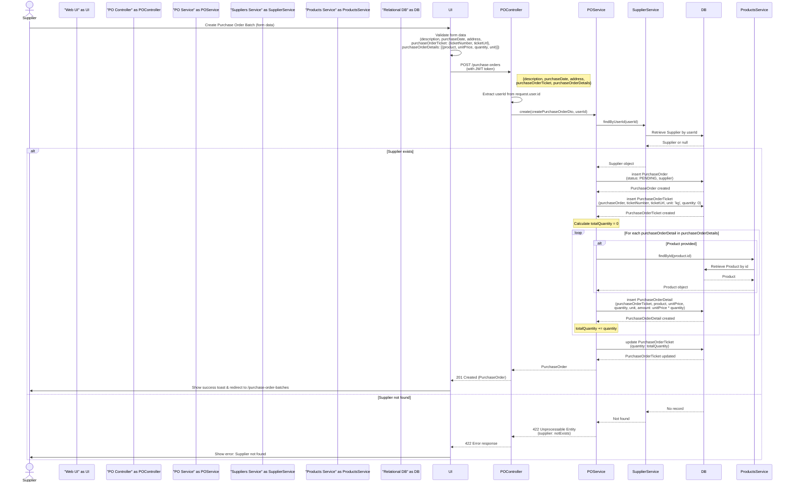

---

## 2. Update Purchase Order Batch Sequence Diagram

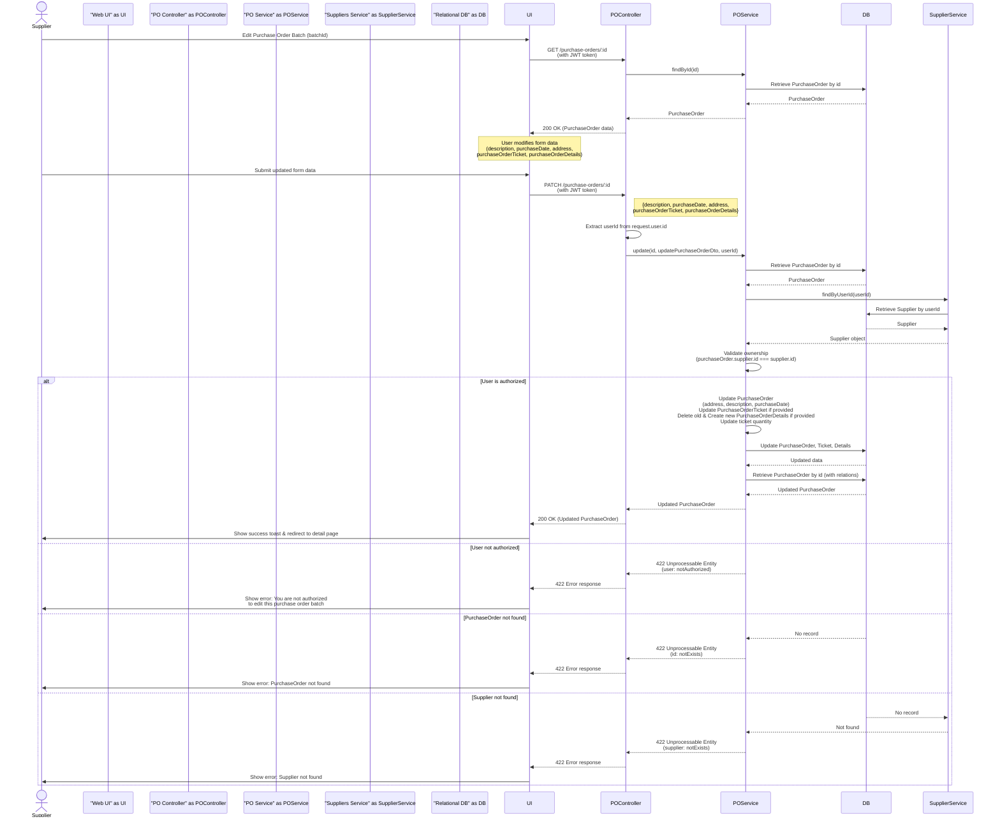

---

## 3. View Purchase Order Batch Details Sequence Diagram

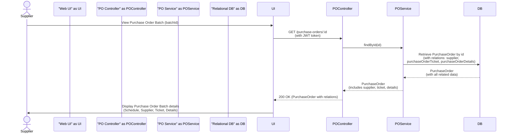

---

## 4. Cancel Purchase Order Batch Sequence Diagram

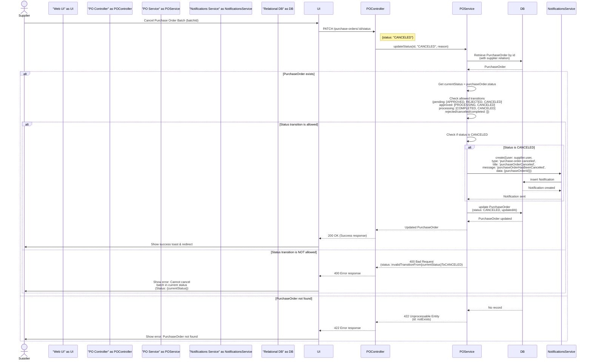

---

## 5. Approve Purchase Order Batch Sequence Diagram

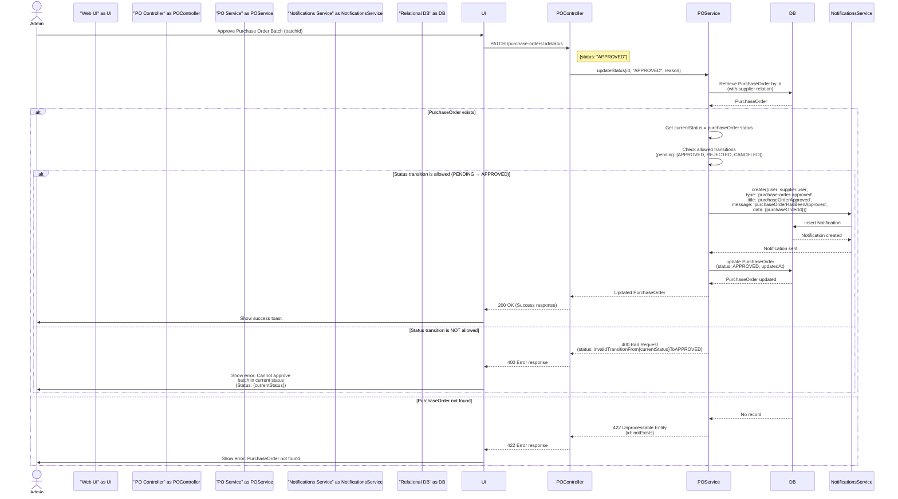

---

## 6. Purchase Order Phase Delivery Sequence Diagram

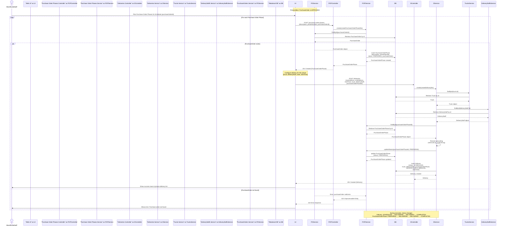

---

## 7. Order Phase Delivery Sequence Diagram

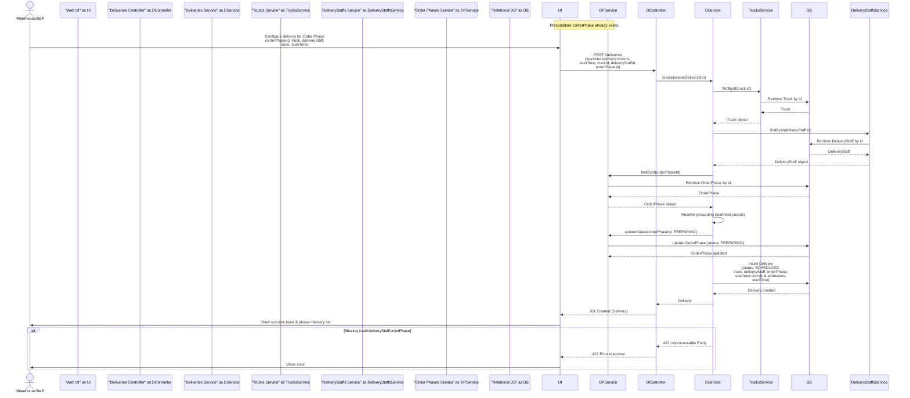

---


---


---

## 8. Update Order Schedule Sequence Diagram

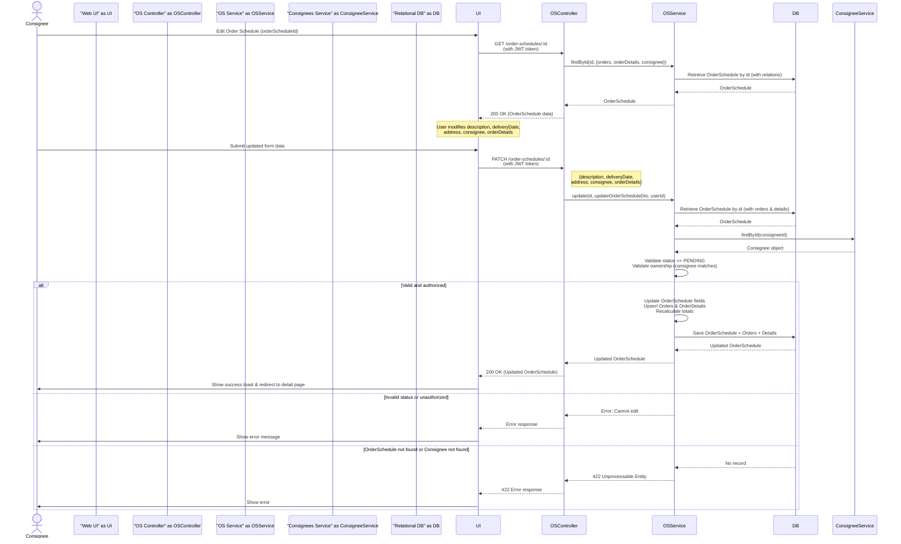

---

## 9. Create Order Schedule Sequence Diagram

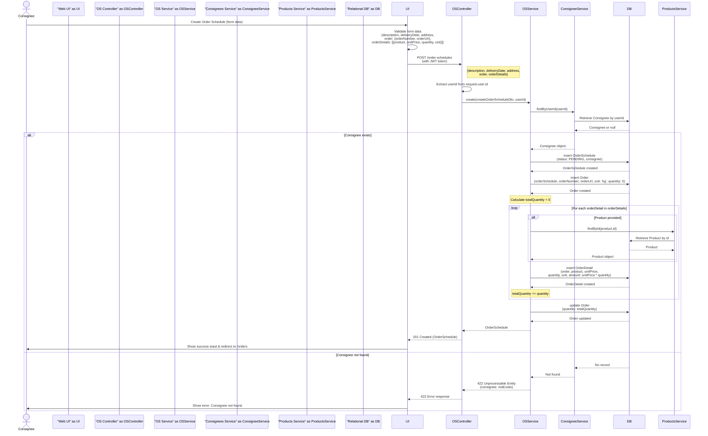

---

## 10. View Order Schedule Sequence Diagram

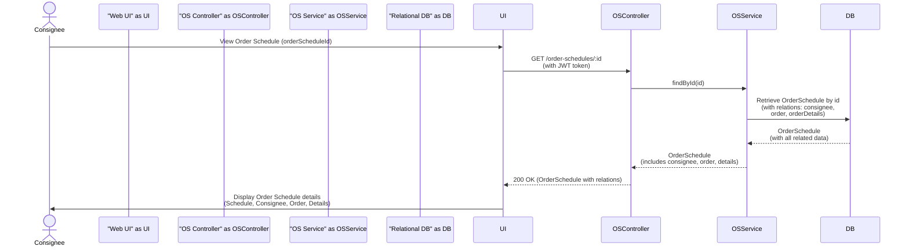

---

## 11. Cancel Order Schedule Sequence Diagram

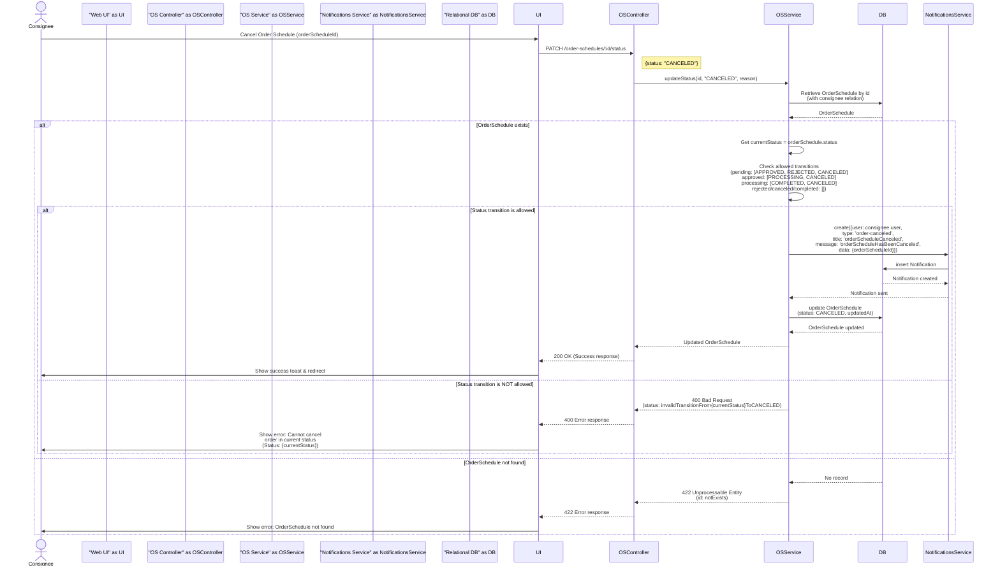

---

## 12. User Authentication (Sign In) Sequence Diagram

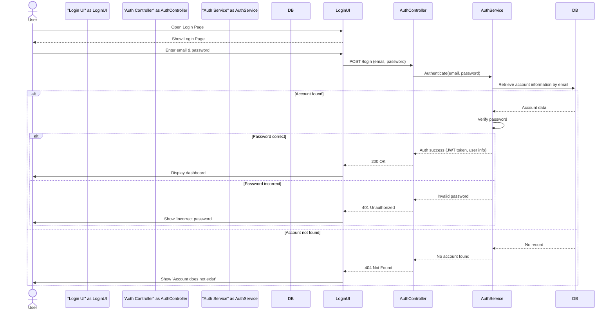

---

## 13. Create Product Sequence Diagram

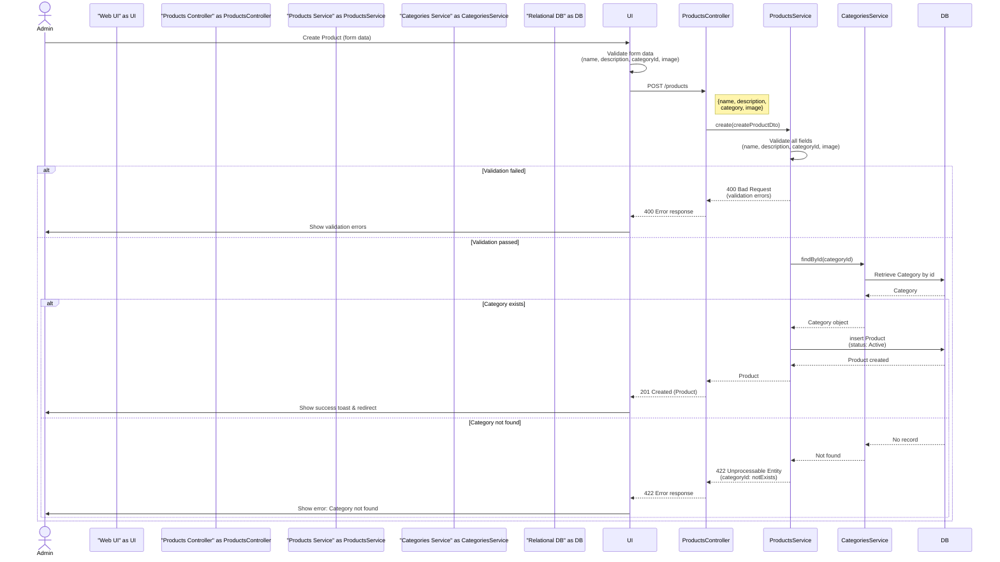

---

## 14. Create Category Sequence Diagram

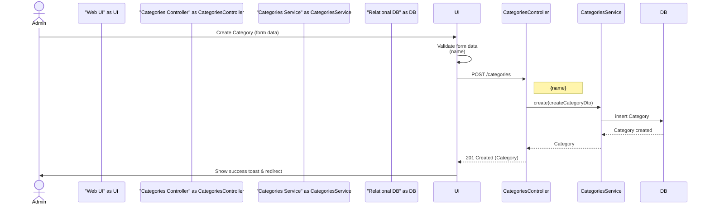

---

## 15. Create Warehouse Sequence Diagram

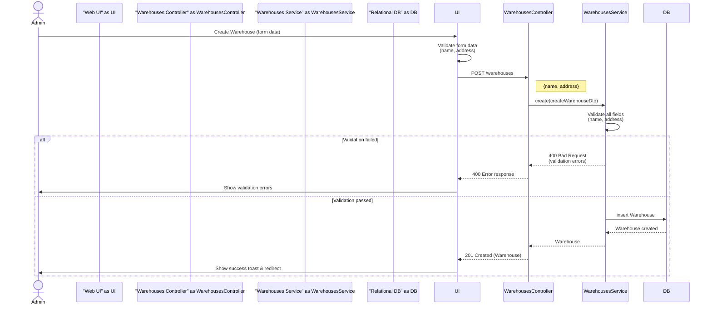

---

## 16. Create Account (General) Sequence Diagram

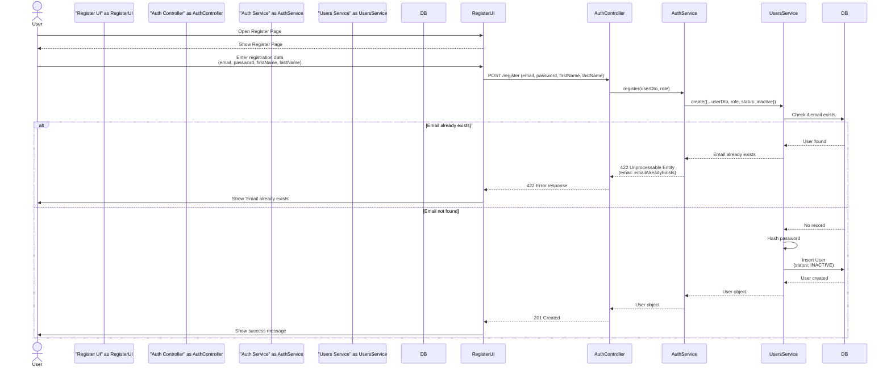

---

## 17. Create Supplier Account Sequence Diagram (Legacy - See Diagram 16 for General Flow)

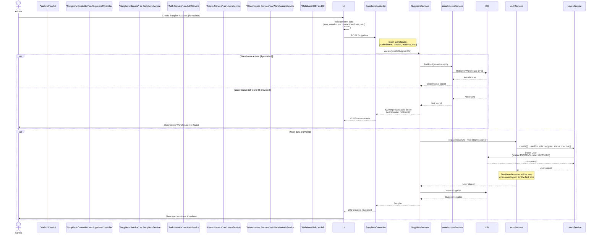

---

## 18. Create Consignee Account Sequence Diagram (Legacy - See Diagram 16 for General Flow)

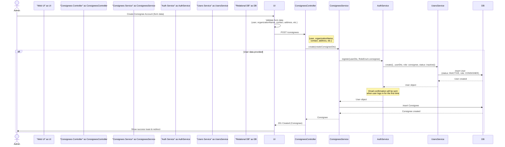

---

## 19. Create Staff Account Sequence Diagram (Legacy - See Diagram 16 for General Flow)

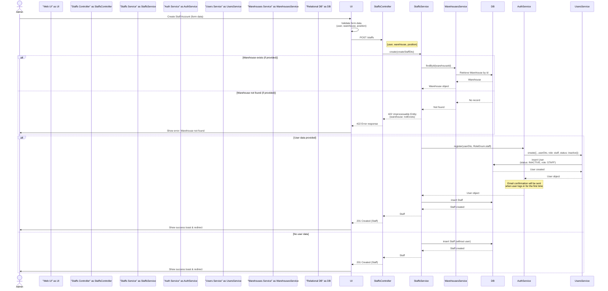

---

## 20. Create Delivery Staff Account Sequence Diagram (Legacy - See Diagram 16 for General Flow)

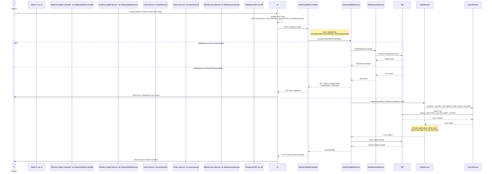

---

## 21. Create Manager Account Sequence Diagram (Legacy - See Diagram 16 for General Flow)

```mermaid
sequenceDiagram
    actor Admin
    participant "Web UI" as UI
    participant "Managers Controller" as ManagersController
    participant "Managers Service" as ManagersService
    participant "Auth Service" as AuthService
    participant "Users Service" as UsersService
    participant "Warehouses Service" as WarehousesService
    participant "Relational DB" as DB

    Admin->>UI: Create Manager Account (form data)
    UI->>UI: Validate form data<br/>(user, warehouse)
    
    UI->>ManagersController: POST /managers
    Note right of ManagersController: {user, warehouse}
    ManagersController->>ManagersService: create(createManagerDto)
    
    alt Warehouse exists (if provided)
        ManagersService->>WarehousesService: findById(warehouseId)
        WarehousesService->>DB: Retrieve Warehouse by id
        DB-->>WarehousesService: Warehouse
        WarehousesService-->>ManagersService: Warehouse object
        
        alt User data provided
            ManagersService->>AuthService: register(userDto, RoleEnum.manager)
            AuthService->>UsersService: create({...userDto, role: manager, status: inactive})
            UsersService->>DB: insert User<br/>(status: INACTIVE, role: MANAGER)
            DB-->>UsersService: User created
            UsersService-->>AuthService: User object
            Note over AuthService: Email confirmation will be sent<br/>when user logs in for the first time
            AuthService-->>ManagersService: User object
            ManagersService->>DB: insert Manager
            DB-->>ManagersService: Manager created
            ManagersService-->>ManagersController: Manager
            ManagersController-->>UI: 201 Created (Manager)
            UI->>Admin: Show success toast & redirect
        else No user data
            ManagersService->>DB: insert Manager (without user)
            DB-->>ManagersService: Manager created
            ManagersService-->>ManagersController: Manager
            ManagersController-->>UI: 201 Created (Manager)
            UI->>Admin: Show success toast & redirect
        end
    else Warehouse not found (if provided)
        DB-->>WarehousesService: No record
        WarehousesService-->>ManagersService: Not found
        ManagersService-->>ManagersController: 422 Unprocessable Entity<br/>(warehouse: notExists)
        ManagersController-->>UI: 422 Error response
        UI->>Admin: Show error: Warehouse not found
    end
```

---

## 22. Reject Purchase Order Batch Sequence Diagram

```mermaid
sequenceDiagram
    actor Admin
    participant "Web UI" as UI
    participant "PO Controller" as POController
    participant "PO Service" as POService
    participant "Notifications Service" as NotificationsService
    participant "Relational DB" as DB

    Admin->>UI: Reject Purchase Order Batch (batchId, reason)
    UI->>POController: PATCH /purchase-orders/:id/status
    Note right of POController: {status: "REJECTED", reason: "..."}
    POController->>POService: updateStatus(id, "REJECTED", reason)
    POService->>DB: Retrieve PurchaseOrder by id<br/>(with supplier relation)
    DB-->>POService: PurchaseOrder
    
    alt PurchaseOrder exists
        POService->>POService: Get currentStatus = purchaseOrder.status
        POService->>POService: Check allowed transitions<br/>(pending: [APPROVED, REJECTED, CANCELED])
        
        alt Status transition is allowed (PENDING → REJECTED)
            POService->>POService: Validate reason is provided
            
            alt Reason is provided
                POService->>NotificationsService: create({user: supplier.user,<br/>type: 'purchase-order-rejected',<br/>title: 'purchaseOrderRejected',<br/>message: 'purchaseOrderHasBeenRejected',<br/>data: {purchaseOrderId, reason}})
                NotificationsService->>DB: insert Notification
                DB-->>NotificationsService: Notification created
                NotificationsService-->>POService: Notification sent
                
                POService->>DB: update PurchaseOrder<br/>(status: REJECTED, reason, updatedAt)
                DB-->>POService: PurchaseOrder updated
                POService-->>POController: Updated PurchaseOrder
                POController-->>UI: 200 OK (Success response)
                UI->>Admin: Show success toast
            else Reason is NOT provided
                POService-->>POController: 400 Bad Request<br/>(reason: reasonRequiredForRejection)
                POController-->>UI: 400 Error response
                UI->>Admin: Show error: Reason is required<br/>for rejection
            end
        else Status transition is NOT allowed
            POService-->>POController: 400 Bad Request<br/>(status: invalidTransitionFrom{currentStatus}ToREJECTED)
            POController-->>UI: 400 Error response
            UI->>Admin: Show error: Cannot reject<br/>batch in current status<br/>(Status: {currentStatus})
        end
    else PurchaseOrder not found
        DB-->>POService: No record
        POService-->>POController: 422 Unprocessable Entity<br/>(id: notExists)
        POController-->>UI: 422 Error response
        UI->>Admin: Show error: PurchaseOrder not found
    end
```

---

## 23. Create Import Ticket Sequence Diagram

```mermaid
sequenceDiagram
    actor Staff
    participant "Web UI" as UI
    participant "ImportTickets Controller" as ITController
    participant "ImportTickets Service" as ITService
    participant "InboundBatches Service" as IBService
    participant "Batches Service" as BatchesService
    participant "Relational DB" as DB

    Staff->>UI: Create Import Ticket (form data)
    Note over UI: {realityQuantity, expiredAt,<br/>inboundBatch?: {id}, area?: {id}}

    UI->>ITController: POST /import-tickets
    ITController->>ITService: create(createImportTicketDto)

    alt inboundBatch provided
        ITService->>IBService: findById(inboundBatch.id)
        IBService->>DB: select InboundBatch by id
        DB-->>IBService: InboundBatch
        IBService-->>ITService: InboundBatch object
    else inboundBatch missing/null
        ITService->>ITService: inboundBatch = null
    end

    ITService->>ITService: percent = realityQuantity /(inboundBatch.quantity||1)*100
    ITService->>DB: insert ImportTicket<br/>(unit:'kg', quantity:realityQuantity,<br/>importDate: now, percent, expiredAt)
    DB-->>ITService: ImportTicket created

    Note over ITService: Split quantity into batches: 20kg, 10kg, remainder

    loop while remaining >= 20
        ITService->>BatchesService: create({quantity:20, unit:'kg', importTicket, area?, product from inboundBatch})
        BatchesService->>DB: insert Batch (20kg)
        DB-->>BatchesService: Batch created
    end

    loop while remaining >= 10
        ITService->>BatchesService: create({quantity:10, unit:'kg', importTicket, area?, product})
        BatchesService->>DB: insert Batch (10kg)
        DB-->>BatchesService: Batch created
    end

    alt remaining > 0
        ITService->>BatchesService: create({quantity: remaining, unit:'kg', importTicket, area?, product})
        BatchesService->>DB: insert Batch (remainder)
        DB-->>BatchesService: Batch created
    end

    ITService-->>ITController: ImportTicket
    ITController-->>UI: 201 Created (ImportTicket)
    UI->>Staff: Show success toast & ticket info
```

---

## 24. Update Delivery Status Sequence Diagram

```mermaid
sequenceDiagram
    actor DeliveryStaff
    participant "Web UI" as UI
    participant "Deliveries Controller" as DController
    participant "Deliveries Service" as DService
    participant "Purchase Order Phases Service" as POPService
    participant "Order Phases Service" as OPService
    participant "Trucks Service" as TrucksService
    participant "Relational DB" as DB

    DeliveryStaff->>UI: Update Delivery Status (deliveryId, status)
    UI->>DController: PATCH /deliveries/:id/status
    Note right of DController: {status: "DELIVERING" | "DELIVERED" | "COMPLETED" | "CANCELED"}
    DController->>DService: updateStatus(id, status)
    DService->>DB: Retrieve Delivery by id<br/>(with purchaseOrderPhase, orderPhase, truck)
    DB-->>DService: Delivery
    
    alt Delivery exists
        DService->>DService: Get currentStatus = delivery.status
        DService->>DService: Check allowed transitions<br/>(scheduled: [DELIVERING, CANCELED]<br/>delivering: [DELIVERED, CANCELED]<br/>delivered: [RETURNING, CANCELED]<br/>returning: [COMPLETED, CANCELED]<br/>completed/canceled: [])
        
        alt Status transition is allowed
            alt Status is DELIVERING
                alt Purchase Order Phase exists
                    DService->>POPService: updateStatus(purchaseOrderPhaseId, DELIVERING)
                    POPService->>DB: update PurchaseOrderPhase<br/>(status: DELIVERING)
                    DB-->>POPService: PurchaseOrderPhase updated
                end
                
                alt Order Phase exists
                    DService->>OPService: updateStatus(orderPhaseId, DELIVERING)
                    OPService->>DB: update OrderPhase<br/>(status: DELIVERING)
                    DB-->>OPService: OrderPhase updated
                end
            else Status is DELIVERED
                alt Purchase Order Phase exists
                    DService->>POPService: updateStatus(purchaseOrderPhaseId, DELIVERED)
                    POPService->>DB: update PurchaseOrderPhase<br/>(status: DELIVERED)
                    DB-->>POPService: PurchaseOrderPhase updated
                end
                
                alt Order Phase exists
                    DService->>OPService: updateStatus(orderPhaseId, DELIVERED)
                    OPService->>DB: update OrderPhase<br/>(status: DELIVERED)
                    DB-->>OPService: OrderPhase updated
                end
            else Status is COMPLETED
                alt Truck exists
                    DService->>TrucksService: updateStatus(truckId, AVAILABLE)
                    TrucksService->>DB: update Truck<br/>(status: AVAILABLE)
                    DB-->>TrucksService: Truck updated
                end
                DService->>DService: Set endTime = now
            else Status is CANCELED
                alt Truck exists
                    DService->>TrucksService: updateStatus(truckId, AVAILABLE)
                    TrucksService->>DB: update Truck<br/>(status: AVAILABLE)
                    DB-->>TrucksService: Truck updated
                end
            end
            
            DService->>DB: update Delivery<br/>(status: newStatus, endTime if COMPLETED)
            DB-->>DService: Delivery updated
            DService-->>DController: Updated Delivery
            DController-->>UI: 200 OK (Updated Delivery)
            UI->>DeliveryStaff: Show success toast
        else Status transition is NOT allowed
            DService-->>DController: 400 Bad Request<br/>(status: invalidTransitionFrom{currentStatus}To{newStatus})
            DController-->>UI: 400 Error response
            UI->>DeliveryStaff: Show error: Cannot change status<br/>from {currentStatus} to {newStatus}
        end
    else Delivery not found
        DB-->>DService: No record
        DService-->>DController: 422 Unprocessable Entity<br/>(id: notExists)
        DController-->>UI: 422 Error response
        UI->>DeliveryStaff: Show error: Delivery not found
    end
```

---

## 25. Approve Order Schedule Sequence Diagram

```mermaid
sequenceDiagram
    actor Admin
    participant "Web UI" as UI
    participant "OS Controller" as OSController
    participant "OS Service" as OSService
    participant "Notifications Service" as NotificationsService
    participant "Relational DB" as DB

    Admin->>UI: Approve Order Schedule (orderScheduleId)
    UI->>OSController: PATCH /order-schedules/:id/status
    Note right of OSController: {status: "APPROVED"}
    OSController->>OSService: updateStatus(id, "APPROVED", reason)
    OSService->>DB: Retrieve OrderSchedule by id<br/>(with consignee relation)
    DB-->>OSService: OrderSchedule
    
    alt OrderSchedule exists
        OSService->>OSService: Get currentStatus = orderSchedule.status
        OSService->>OSService: Check allowed transitions<br/>(pending: [APPROVED, REJECTED, CANCELED])
        
        alt Status transition is allowed (PENDING → APPROVED)
            OSService->>NotificationsService: create({user: consignee.user,<br/>type: 'order-approved',<br/>title: 'orderScheduleApproved',<br/>message: 'orderScheduleHasBeenApproved',<br/>data: {orderScheduleId}})
            NotificationsService->>DB: insert Notification
            DB-->>NotificationsService: Notification created
            NotificationsService-->>OSService: Notification sent
            
            OSService->>DB: update OrderSchedule<br/>(status: APPROVED, updatedAt)
            DB-->>OSService: OrderSchedule updated
            OSService-->>OSController: Updated OrderSchedule
            OSController-->>UI: 200 OK (Success response)
            UI->>Admin: Show success toast
        else Status transition is NOT allowed
            OSService-->>OSController: 400 Bad Request<br/>(status: invalidTransitionFrom{currentStatus}ToAPPROVED)
            OSController-->>UI: 400 Error response
            UI->>Admin: Show error: Cannot approve<br/>order in current status<br/>(Status: {currentStatus})
        end
    else OrderSchedule not found
        DB-->>OSService: No record
        OSService-->>OSController: 422 Unprocessable Entity<br/>(id: notExists)
        OSController-->>UI: 422 Error response
        UI->>Admin: Show error: OrderSchedule not found
    end
```

---

## 26. Reject Order Schedule Sequence Diagram

```mermaid
sequenceDiagram
    actor Admin
    participant "Web UI" as UI
    participant "OS Controller" as OSController
    participant "OS Service" as OSService
    participant "Notifications Service" as NotificationsService
    participant "Relational DB" as DB

    Admin->>UI: Reject Order Schedule (orderScheduleId, reason)
    UI->>OSController: PATCH /order-schedules/:id/status
    Note right of OSController: {status: "REJECTED", reason: "..."}
    OSController->>OSService: updateStatus(id, "REJECTED", reason)
    OSService->>DB: Retrieve OrderSchedule by id<br/>(with consignee relation)
    DB-->>OSService: OrderSchedule
    
    alt OrderSchedule exists
        OSService->>OSService: Get currentStatus = orderSchedule.status
        OSService->>OSService: Check allowed transitions<br/>(pending: [APPROVED, REJECTED, CANCELED])
        
        alt Status transition is allowed (PENDING → REJECTED)
            OSService->>OSService: Validate reason is provided
            
            alt Reason is provided
                OSService->>NotificationsService: create({user: consignee.user,<br/>type: 'order-rejected',<br/>title: 'orderScheduleRejected',<br/>message: 'orderScheduleHasBeenRejected',<br/>data: {orderScheduleId, reason}})
                NotificationsService->>DB: insert Notification
                DB-->>NotificationsService: Notification created
                NotificationsService-->>OSService: Notification sent
                
                OSService->>DB: update OrderSchedule<br/>(status: REJECTED, reason, updatedAt)
                DB-->>OSService: OrderSchedule updated
                OSService-->>OSController: Updated OrderSchedule
                OSController-->>UI: 200 OK (Success response)
                UI->>Admin: Show success toast
            else Reason is NOT provided
                OSService-->>OSController: 400 Bad Request<br/>(reason: reasonRequiredForRejection)
                OSController-->>UI: 400 Error response
                UI->>Admin: Show error: Reason is required<br/>for rejection
            end
        else Status transition is NOT allowed
            OSService-->>OSController: 400 Bad Request<br/>(status: invalidTransitionFrom{currentStatus}ToREJECTED)
            OSController-->>UI: 400 Error response
            UI->>Admin: Show error: Cannot reject<br/>order in current status<br/>(Status: {currentStatus})
        end
    else OrderSchedule not found
        DB-->>OSService: No record
        OSService-->>OSController: 422 Unprocessable Entity<br/>(id: notExists)
        OSController-->>UI: 422 Error response
        UI->>Admin: Show error: OrderSchedule not found
    end
```

---

## 27. Create Export Ticket Sequence Diagram

```mermaid
sequenceDiagram
    actor Staff
    participant "Web UI" as UI
    participant "Export Tickets Controller" as ETController
    participant "Export Tickets Service" as ETService
    participant "Order Invoice Details Service" as OIDService
    participant "Batches Service" as BatchesService
    participant "Areas Service" as AreasService
    participant "Relational DB" as DB

    Staff->>UI: Create Export Ticket (form data)
    UI->>UI: Validate form data<br/>(invoiceDetails: [{orderInvoiceDetailId, batchIds}])
    
    UI->>ETController: POST /export-tickets
    Note right of ETController: {invoiceDetails: [{orderInvoiceDetailId, batchIds}]}
    ETController->>ETService: create(createExportTicketDto)
    
    loop For each invoiceDetail in invoiceDetails
        ETService->>OIDService: findById(orderInvoiceDetailId)
        OIDService->>DB: Retrieve OrderInvoiceDetail by id
        DB-->>OIDService: OrderInvoiceDetail
        
        alt OrderInvoiceDetail exists
            OIDService-->>ETService: OrderInvoiceDetail object
            ETService->>BatchesService: findByIds(batchIds)
            BatchesService->>DB: Retrieve Batches by ids
            DB-->>BatchesService: Batches
            
            alt All batches found
                BatchesService-->>ETService: Batches array
                ETService->>ETService: Validate product match<br/>(batch.product.id === orderInvoiceDetail.product.id)
                
                alt Products match
                    ETService->>AreasService: findById(areaId from first batch)
                    AreasService->>DB: Retrieve Area by id
                    DB-->>AreasService: Area
                    
                    alt Area exists
                        AreasService-->>ETService: Area object
                        ETService->>DB: insert ExportTicket<br/>(exportDate: now, unit, quantity)
                        DB-->>ETService: ExportTicket created
                        
                        ETService->>DB: update OrderInvoiceDetail<br/>(exportTicket: exportTicket)
                        DB-->>ETService: OrderInvoiceDetail updated
                        
                        loop For each batch in batches
                            ETService->>BatchesService: update(batchId, {exportTicket})
                            BatchesService->>DB: update Batch<br/>(exportTicket: exportTicket)
                            DB-->>BatchesService: Batch updated
                        end
                        
                        ETService->>AreasService: update(areaId, {quantity: area.quantity - orderInvoiceDetail.quantity})
                        AreasService->>DB: update Area<br/>(quantity: decreased)
                        DB-->>AreasService: Area updated
                    else Area not found
                        DB-->>AreasService: No record
                        AreasService-->>ETService: Not found
                        ETService-->>ETController: 422 Unprocessable Entity<br/>(area: notExists)
                        ETController-->>UI: 422 Error response
                        UI->>Staff: Show error: Area not found
                    end
                else Products do not match
                    ETService-->>ETController: 422 Unprocessable Entity<br/>(batch: productMismatch)
                    ETController-->>UI: 422 Error response
                    UI->>Staff: Show error: Batch product does not match<br/>OrderInvoiceDetail product
                end
            else Some batches not found
                DB-->>BatchesService: Partial results
                BatchesService-->>ETService: Some batches missing
                ETService-->>ETController: 422 Unprocessable Entity<br/>(batchs: someBatchNotExists)
                ETController-->>UI: 422 Error response
                UI->>Staff: Show error: Some batches not found
            end
        else OrderInvoiceDetail not found
            DB-->>OIDService: No record
            OIDService-->>ETService: Not found
            ETService-->>ETController: 422 Unprocessable Entity<br/>(orderInvoiceDetail: notExists)
            ETController-->>UI: 422 Error response
            UI->>Staff: Show error: OrderInvoiceDetail not found
        end
    end
    
    ETService-->>ETController: ExportTickets array
    ETController-->>UI: 201 Created (ExportTickets)
    UI->>Staff: Show success toast & export tickets info
```

---

## 28. View Export Ticket Details Sequence Diagram

```mermaid
sequenceDiagram
    actor Staff
    participant "Web UI" as UI
    participant "Export Tickets Controller" as ETController
    participant "Export Tickets Service" as ETService
    participant "Relational DB" as DB

    Staff->>UI: View Export Ticket (exportTicketId)
    UI->>ETController: GET /export-tickets/:id
    ETController->>ETService: findById(id)
    ETService->>DB: Retrieve ExportTicket by id<br/>(with relations)
    DB-->>ETService: ExportTicket<br/>(with all related data)
    ETService-->>ETController: ExportTicket
    ETController-->>UI: 200 OK (ExportTicket)
    UI->>Staff: Display Export Ticket details
```

---

## 29. Delete Export Ticket Sequence Diagram

```mermaid
sequenceDiagram
    actor Staff
    participant "Web UI" as UI
    participant "Export Tickets Controller" as ETController
    participant "Export Tickets Service" as ETService
    participant "Relational DB" as DB

    Staff->>UI: Delete Export Ticket (exportTicketId)
    UI->>ETController: DELETE /export-tickets/:id
    ETController->>ETService: remove(id)
    ETService->>DB: Retrieve ExportTicket by id
    DB-->>ETService: ExportTicket
    
    alt ExportTicket exists
        ETService->>DB: delete ExportTicket
        DB-->>ETService: ExportTicket deleted
        ETService-->>ETController: Success
        ETController-->>UI: 200 OK
        UI->>Staff: Show success toast
    else ExportTicket not found
        DB-->>ETService: No record
        ETService-->>ETController: 422 Unprocessable Entity<br/>(id: notExists)
        ETController-->>UI: 422 Error response
        UI->>Staff: Show error: ExportTicket not found
    end
```

---

## 30. View Export Tickets by Area Sequence Diagram

```mermaid
sequenceDiagram
    actor Staff
    participant "Web UI" as UI
    participant "Export Tickets Controller" as ETController
    participant "Export Tickets Service" as ETService
    participant "Relational DB" as DB

    Staff->>UI: View Export Tickets by Area (areaId)
    UI->>ETController: GET /export-tickets/by-area/:areaId<br/>?page=1&limit=10
    ETController->>ETService: findByAreaWithPagination({areaId, paginationOptions})
    ETService->>DB: Retrieve ExportTickets by areaId<br/>(with pagination)
    DB-->>ETService: ExportTickets array<br/>(paginated)
    ETService-->>ETController: ExportTickets array
    ETController-->>UI: 200 OK (ExportTickets with pagination)
    UI->>Staff: Display Export Tickets list<br/>(filtered by area)
```

---

## 31. Create Payment Sequence Diagram

```mermaid
sequenceDiagram
    actor User
    participant "Web UI" as UI
    participant "Payments Controller" as PController
    participant "Payments Service" as PService
    participant "PayOS" as PayOS
    participant "Relational DB" as DB

    User->>UI: Create Payment (amount, paymentMethod: transfer|cash)
    UI->>UI: Validate form data
    
    UI->>PController: POST /payments
    Note right of PController: {amount, paymentMethod}
    PController->>PService: create(createPaymentDto)
    PService->>PService: Generate paymentCode
    
    alt paymentMethod = transfer
        PService->>PayOS: paymentRequests.create({orderCode: paymentCode, amount})
        PayOS-->>PService: checkoutUrl, qrCode
        PService->>DB: insert Payment<br/>(paymentCode, status: PENDING,<br/>amount, paymentMethod, checkoutUrl, qrCode)
        DB-->>PService: Payment created
        PService-->>PController: Payment (with checkoutUrl, qrCode)
        PController-->>UI: 201 Created (Payment)
        UI->>User: Show QR/checkoutUrl
    else paymentMethod = cash
        PService->>DB: insert Payment<br/>(paymentCode, status: PENDING,<br/>amount, paymentMethod)
        DB-->>PService: Payment created
        PService-->>PController: Payment
        PController-->>UI: 201 Created (Payment)
        UI->>User: Show payment code (cash)
    end
```

---

## 32. View Payment Details Sequence Diagram

```mermaid
sequenceDiagram
    actor User
    participant "Web UI" as UI
    participant "Payments Controller" as PController
    participant "Payments Service" as PService
    participant "Relational DB" as DB

    User->>UI: View Payment (paymentId)
    UI->>PController: GET /payments/:id
    PController->>PService: findById(id)
    PService->>DB: Retrieve Payment by id
    DB-->>PService: Payment
    PService-->>PController: Payment
    PController-->>UI: 200 OK (Payment)
    UI->>User: Display payment details
```

---

## 33. Confirm Payment Sequence Diagram (PayOS & Cash)

```mermaid
sequenceDiagram
    actor PayOS
    actor Staff
    participant "Payments Controller" as PController
    participant "Payments Service" as PService
    participant "Relational DB" as DB
    participant "SSE Client" as SSEClient

    %% PayOS webhook (transfer)
    PayOS-->>PService: webhook (orderCode, code=00|!=00)
    PService->>PService: verify webhook
    PService->>DB: find Payment by paymentCode
    DB-->>PService: Payment
    alt Payment found
        alt code = 00 (success)
            PService->>DB: update Payment (status: PAID)
        else code != 00
            PService->>DB: update Payment (status: CANCELED)
        end
        DB-->>PService: Payment updated
        PService-->>SSEClient: Emit payment update (status)
    else Payment not found
        PService-->>PayOS: 404/NotFound
    end

    %% Cash confirmation (manual)
    Staff->>PController: PATCH /payments/confirm-payment-paid-by-cash/:paymentCode
    PController->>PService: confirmPaymentPaidByCash(paymentCode)
    PService->>DB: find Payment by paymentCode
    DB-->>PService: Payment
    alt Payment exists and status = PENDING
        PService->>DB: update Payment (status: PAID)
        DB-->>PService: Payment updated
        PService-->>PController: Payment (PAID)
        PController-->>Staff: 200 OK (Payment)
    else Payment not found or not PENDING
        PService-->>PController: 400/404 Error
        PController-->>Staff: Error response
    end
```

---

## 34. Cancel Payment (PayOS) Sequence Diagram

```mermaid
sequenceDiagram
    actor Staff
    participant "Web UI" as UI
    participant "Payments Controller" as PController
    participant "Payments Service" as PService
    participant "PayOS" as PayOS
    participant "Relational DB" as DB

    Staff->>UI: Cancel Payment (paymentCode, reason?)
    UI->>PController: POST /payments/payos/:paymentCode/cancel
    PController->>PService: cancelPayment(paymentCode, cancellationReason)
    PService->>DB: find Payment by paymentCode
    DB-->>PService: Payment
    
    alt Payment exists and status = PENDING
        alt paymentMethod = transfer
            PService->>PayOS: paymentRequests.cancel(paymentCode, reason)
            PayOS-->>PService: cancelResult
            PService->>DB: update Payment (status: CANCELED)
            DB-->>PService: Payment updated
            PService-->>PController: cancelResult
        else paymentMethod != transfer
            PService->>DB: update Payment (status: CANCELED)
            DB-->>PService: Payment updated
            PService-->>PController: Payment (CANCELED)
        end
        PController-->>UI: 200 OK
        UI->>Staff: Show success toast
    else Payment not found or not PENDING
        PService-->>PController: 400/404 Error
        PController-->>UI: Error response
        UI->>Staff: Show error
    end
```

---

## 35. Create Notification Sequence Diagram

```mermaid
sequenceDiagram
    actor System
    participant "Notifications Controller" as NController
    participant "Notifications Service" as NService
    participant "Users Service" as UsersService
    participant "Notifications Gateway" as NGateway
    participant "Relational DB" as DB

    System->>NController: POST /notifications {userId, title, message, type, data}
    NController->>NService: create(createNotificationDto)
    NService->>UsersService: findById(userId)
    UsersService->>DB: Retrieve User by id
    DB-->>UsersService: User
    
    alt User exists
        UsersService-->>NService: User object
        NService->>DB: insert Notification<br/>(user, title, message, type, data, isRead:false)
        DB-->>NService: Notification created
        NService->>NGateway: push to user by role (supplier/consignee/manager/staff/delivery_staff)
        NGateway-->>NService: delivered
        NService-->>NController: Notification
        NController-->>System: 201 Created (Notification)
    else User not found
        DB-->>UsersService: No record
        UsersService-->>NService: Not found
        NService-->>NController: 422 Unprocessable Entity (user: notExists)
        NController-->>System: 422 Error response
    end
```

---

## 36. View Notifications List Sequence Diagram

```mermaid
sequenceDiagram
    actor User
    participant "Web UI" as UI
    participant "Notifications Controller" as NController
    participant "Notifications Service" as NService
    participant "Relational DB" as DB

    User->>UI: View Notifications (page, limit)
    UI->>NController: GET /notifications?page=1&limit=10
    NController->>NService: findAllWithPagination({page, limit, userId})
    NService->>DB: Retrieve Notifications by userId (paginated)
    DB-->>NService: Notifications[]
    NService-->>NController: Notifications[]
    NController-->>UI: 200 OK (Notifications paginated)
    UI->>User: Display notifications list
```

---

## 37. Mark Notification as Read Sequence Diagram

```mermaid
sequenceDiagram
    actor User
    participant "Web UI" as UI
    participant "Notifications Controller" as NController
    participant "Notifications Service" as NService
    participant "Relational DB" as DB

    User->>UI: Mark notification as read (notificationId)
    UI->>NController: PATCH /notifications/:id {isRead: true}
    NController->>NService: update(id, {isRead: true})
    NService->>DB: Retrieve Notification by id
    DB-->>NService: Notification
    
    alt Notification exists
        NService->>DB: update Notification (isRead: true)
        DB-->>NService: Notification updated
        NService-->>NController: Notification
        NController-->>UI: 200 OK
        UI->>User: Update UI (marked as read)
    else Notification not found
        DB-->>NService: No record
        NService-->>NController: 422 Unprocessable Entity (id: notExists)
        NController-->>UI: 422 Error response
        UI->>User: Show error: Notification not found
    end
```

---

## 38. Delete Notification Sequence Diagram

```mermaid
sequenceDiagram
    actor User
    participant "Web UI" as UI
    participant "Notifications Controller" as NController
    participant "Notifications Service" as NService
    participant "Relational DB" as DB

    User->>UI: Delete notification (notificationId)
    UI->>NController: DELETE /notifications/:id
    NController->>NService: remove(id)
    NService->>DB: Retrieve Notification by id
    DB-->>NService: Notification
    
    alt Notification exists
        NService->>DB: delete Notification
        DB-->>NService: Notification deleted
        NService-->>NController: Success
        NController-->>UI: 200 OK
        UI->>User: Show success toast
    else Notification not found
        DB-->>NService: No record
        NService-->>NController: 422 Unprocessable Entity (id: notExists)
        NController-->>UI: 422 Error response
        UI->>User: Show error: Notification not found
    end
```

---

## 39. Create Purchase Order Phase Sequence Diagram (No Delivery)

```mermaid
sequenceDiagram
    actor WarehouseStaff
    participant "Web UI" as UI
    participant "Purchase Order Phases Controller" as POPController
    participant "Purchase Order Phases Service" as POPService
    participant "Purchase Orders Service" as POService
    participant "Purchase Order Validation Service" as POValidation
    participant "Products Service" as ProductsService
    participant "Relational DB" as DB

    WarehouseStaff->>UI: Create Purchase Order Phase (description, phaseNumber,<br/>purchaseOrderId, purchaseOrderInvoice, purchaseOrderInvoiceDetails[{product, unitPrice, quantity, unit}])
    UI->>POPController: POST /purchase-order-phases
    Note right of POPController: {description, phaseNumber,<br/>purchaseOrder, purchaseOrderInvoice,<br/>purchaseOrderInvoiceDetails}
    POPController->>POPService: create(createPurchaseOrderPhaseDto)
    POPService->>POService: findById(purchaseOrder.id)
    POService->>DB: Retrieve PurchaseOrder by id
    DB-->>POService: PurchaseOrder
    
    alt PurchaseOrder exists
        POService-->>POPService: PurchaseOrder object
        POPService->>POValidation: validatePhaseAddition(purchaseOrderId, [{productId, quantity}])
        POValidation-->>POPService: Validation OK
        
        POPService->>DB: insert PurchaseOrderPhase<br/>(description, phaseNumber, purchaseOrder)
        DB-->>POPService: PurchaseOrderPhase created
        POPService->>DB: insert PurchaseOrderInvoice<br/>(taxRate, invoiceNumber, invoiceUrl,<br/>unit:'kg', totals=0, purchaseOrderPhase)
        DB-->>POPService: PurchaseOrderInvoice created
        
        loop For each purchaseOrderInvoiceDetail
            POPService->>ProductsService: findById(product.id)
            ProductsService->>DB: Retrieve Product by id
            DB-->>ProductsService: Product
            ProductsService-->>POPService: Product object
            
            POPService->>DB: insert PurchaseOrderInvoiceDetail<br/>(purchaseOrderInvoice, product,<br/>unitPrice, quantity, unit,<br/>amount: unitPrice * quantity)
            DB-->>POPService: PurchaseOrderInvoiceDetail created
        end
        
        Note over POPService: Recalculate totals (totalAmount, vatAmount, totalPayment, quantity)
        POPService->>DB: update PurchaseOrderInvoice totals
        DB-->>POPService: PurchaseOrderInvoice updated
        
        POPService-->>POPController: PurchaseOrderPhase
        POPController-->>UI: 201 Created (PurchaseOrderPhase)
        UI->>WarehouseStaff: Show success toast
    else PurchaseOrder not found
        DB-->>POService: No record
        POService-->>POPService: Not found
        POPService-->>POPController: 422 Unprocessable Entity (purchaseOrder: notExists)
        POPController-->>UI: 422 Error response
        UI->>WarehouseStaff: Show error: PurchaseOrder not found
    end
```

---

## 40. Update Purchase Order Phase Sequence Diagram

```mermaid
sequenceDiagram
    actor WarehouseStaff
    participant "Web UI" as UI
    participant "Purchase Order Phases Controller" as POPController
    participant "Purchase Order Phases Service" as POPService
    participant "Purchase Orders Service" as POService
    participant "Purchase Order Validation Service" as POValidation
    participant "Products Service" as ProductsService
    participant "Relational DB" as DB

    WarehouseStaff->>UI: Update Purchase Order Phase (phaseId, fields)
    UI->>POPController: PATCH /purchase-order-phases/:id
    POPController->>POPService: update(id, updatePurchaseOrderPhaseDto)
    POPService->>DB: find PurchaseOrderPhase by id (with invoice & details)
    DB-->>POPService: PurchaseOrderPhase
    
    alt PurchaseOrderPhase exists
        alt purchaseOrder provided
            POPService->>POService: findById(purchaseOrder.id)
            POService-->>POPService: PurchaseOrder or error
        end
        
        alt invoice details provided
            POPService->>DB: remove old PurchaseOrderInvoiceDetails
            loop For each new detail
                POPService->>ProductsService: findById(product.id)
                ProductsService-->>POPService: Product or error
                POPService->>DB: insert PurchaseOrderInvoiceDetail
                DB-->>POPService: Detail created
            end
            Note over POPService: Revalidate limits via POValidation
        end
        
        POPService->>DB: update PurchaseOrderPhase fields<br/>(description, phaseNumber, purchaseOrder?)
        DB-->>POPService: PurchaseOrderPhase updated
        Note over POPService: Recalculate invoice totals
        POPService-->>POPController: Updated PurchaseOrderPhase
        POPController-->>UI: 200 OK
        UI->>WarehouseStaff: Show success toast
    else PurchaseOrderPhase not found
        DB-->>POPService: No record
        POPService-->>POPController: 422 Unprocessable Entity (id: notExists)
        POPController-->>UI: 422 Error response
        UI->>WarehouseStaff: Show error: PurchaseOrderPhase not found
    end
```

---

## 41. Update Purchase Order Phase Status Sequence Diagram

```mermaid
sequenceDiagram
    actor WarehouseStaff
    participant "Web UI" as UI
    participant "Deliveries Controller" as DelController
    participant "Deliveries Service" as DelService
    participant "Purchase Order Phases Service" as POPService
    participant "Relational DB" as DB

    WarehouseStaff->>UI: Update Delivery Status (deliveryId, status)
    UI->>DelController: PATCH /deliveries/:id/status
    Note right of DelController: {status: SCHEDULED | DELIVERING | DELIVERED | RETURNING | COMPLETED | CANCELED}
    DelController->>DelService: updateStatus(id, status)
    DelService->>DB: Retrieve Delivery with purchaseOrderPhase
    DB-->>DelService: Delivery (+PurchaseOrderPhase)
    
    alt Delivery exists
        DelService->>DelService: Validate delivery transition
        Note right of DelService: scheduled→delivering/canceled<br/>delivering→delivered/canceled<br/>delivered→returning/canceled<br/>returning→completed/canceled<br/>completed/canceled: []
        alt Allowed
            opt Has purchaseOrderPhase
                DelService->>POPService: updateStatus(purchaseOrderPhase.id, mappedStatus)
                Note right of POPService: delivery scheduled→purchaseOrderPhase preparing<br/>delivery delivering→purchaseOrderPhase delivering<br/>delivery delivered→purchaseOrderPhase delivered<br/>other delivery statuses: no change
            end
            DelService->>DB: update Delivery (status, updatedAt)
            DB-->>DelService: Delivery updated
            DelService-->>DelController: Updated Delivery
            DelController-->>UI: 200 OK
            UI->>WarehouseStaff: Show success toast
        else Not allowed
            DelService-->>DelController: 422 invalidTransition
            DelController-->>UI: 422 Error response
            UI->>WarehouseStaff: Show error: Cannot change status
        end
    else Delivery not found
        DB-->>DelService: No record
        DelService-->>DelController: 400 Bad Request (id: notExists)
        DelController-->>UI: 400 Error response
        UI->>WarehouseStaff: Show error: Delivery not found
    end
```

---

## 42. Upload Image Proof for Purchase Order Phase Sequence Diagram

```mermaid
sequenceDiagram
    actor WarehouseStaff
    participant "Web UI" as UI
    participant "Purchase Order Phases Controller" as POPController
    participant "Purchase Order Phases Service" as POPService
    participant "Image Proofs Service" as ImgService
    participant "Files (Cloudinary)" as FilesSvc
    participant "Relational DB" as DB

    WarehouseStaff->>UI: Upload image proof (file, phaseId)
    UI->>POPController: POST /purchase-order-phases/:id/upload-img-proof (multipart file)
    POPController->>POPService: uploadImgProof(id, file)
    POPService->>ImgService: upload(file)
    ImgService->>FilesSvc: upload to cloud
    FilesSvc-->>ImgService: fileUrl/path
    ImgService-->>POPService: {path}
    POPService-->>POPController: {path}
    POPController-->>UI: 200 OK ({path})
    UI->>WarehouseStaff: Show success (image uploaded)
```

---

## 43. View Purchase Order Phase Details Sequence Diagram

```mermaid
sequenceDiagram
    actor WarehouseStaff
    participant "Web UI" as UI
    participant "Purchase Order Phases Controller" as POPController
    participant "Purchase Order Phases Service" as POPService
    participant "Relational DB" as DB

    WarehouseStaff->>UI: View Purchase Order Phase (phaseId)
    UI->>POPController: GET /purchase-order-phases/:id
    POPController->>POPService: findById(id)
    POPService->>DB: Retrieve PurchaseOrderPhase by id<br/>(with schedule, invoice, details)
    DB-->>POPService: PurchaseOrderPhase (with relations)
    POPService-->>POPController: PurchaseOrderPhase
    POPController-->>UI: 200 OK (PurchaseOrderPhase)
    UI->>WarehouseStaff: Display phase details
```

---

## 44. Create Order Phase Sequence Diagram (No Delivery)

```mermaid
sequenceDiagram
    actor WarehouseStaff
    participant "Web UI" as UI
    participant "Order Phases Controller" as OPController
    participant "Order Phases Service" as OPService
    participant "Order Schedules Service" as OSService
    participant "Order Schedule Validation Service" as OSValidation
    participant "Products Service" as ProductsService
    participant "Relational DB" as DB

    WarehouseStaff->>UI: Create Order Phase (description, phaseNumber,<br/>orderScheduleId, orderInvoice, orderInvoiceDetails[{product, unitPrice, quantity, unit}])
    UI->>OPController: POST /order-phases
    Note right of OPController: {description, phaseNumber,<br/>orderSchedule, orderInvoice,<br/>orderInvoiceDetails}
    OPController->>OPService: create(createOrderPhaseDto)
    OPService->>OSService: findById(orderSchedule.id)
    OSService->>DB: Retrieve OrderSchedule by id
    DB-->>OSService: OrderSchedule
    
    alt OrderSchedule exists
        OSService-->>OPService: OrderSchedule object
        OPService->>OSValidation: validatePhaseAddition(orderScheduleId, [{productId, quantity}])
        OSValidation-->>OPService: Validation OK
        
        OPService->>DB: insert OrderPhase<br/>(description, phaseNumber, orderSchedule)
        DB-->>OPService: OrderPhase created
        OPService->>DB: insert OrderInvoice<br/>(taxRate, invoiceNumber, invoiceUrl,<br/>unit:'kg', totals=0, orderPhase)
        DB-->>OPService: OrderInvoice created
        
        loop For each orderInvoiceDetail
            OPService->>ProductsService: findById(product.id)
            ProductsService-->>OPService: Product or error
            OPService->>DB: insert OrderInvoiceDetail<br/>(orderInvoice, product,<br/>unitPrice, quantity, unit,<br/>amount: unitPrice * quantity)
            DB-->>OPService: OrderInvoiceDetail created
        end
        
        Note over OPService: Recalculate totals (totalAmount, vatAmount, totalPayment, quantity)
        OPService->>DB: update OrderInvoice totals
        DB-->>OPService: OrderInvoice updated
        
        OPService-->>OPController: OrderPhase
        OPController-->>UI: 201 Created (OrderPhase)
        UI->>WarehouseStaff: Show success toast
    else OrderSchedule not found
        DB-->>OSService: No record
        OSService-->>OPService: Not found
        OPService-->>OPController: 422 Unprocessable Entity (orderSchedule: notExists)
        OPController-->>UI: 422 Error response
        UI->>WarehouseStaff: Show error: OrderSchedule not found
    end
```

---

## 45. Create Multiple Order Phases Sequence Diagram

```mermaid
sequenceDiagram
    actor WarehouseStaff
    participant "Web UI" as UI
    participant "Order Phases Controller" as OPController
    participant "Order Phases Service" as OPService

    WarehouseStaff->>UI: Create Multiple Order Phases [{orderPhaseDto}, ...]
    UI->>OPController: POST /order-phases/multiple
    OPController->>OPService: createMultiple(createMultipleOrderPhaseDto)
    
    loop For each orderPhaseDto
        OPService->>OPService: create(orderPhaseDto) (reuse flow of Diagram 44)
    end
    
    OPService-->>OPController: OrderPhases[]
    OPController-->>UI: 201 Created (OrderPhases)
    UI->>WarehouseStaff: Show success toast
```

---

## 46. Update Order Phase Sequence Diagram (driven by Delivery status)

```mermaid
sequenceDiagram
    actor DeliveryStaff
    participant "Web UI" as UI
    participant "Deliveries Controller" as DController
    participant "Deliveries Service" as DService
    participant "Order Phases Service" as OPService
    participant "Relational DB" as DB

    DeliveryStaff->>UI: Update Delivery Status (deliveryId, status)
    UI->>DController: PATCH /deliveries/:id/status
    Note right of DController: {status: SCHEDULED | DELIVERING | DELIVERED | RETURNING | COMPLETED | CANCELED}
    DController->>DService: updateStatus(id, status)
    DService->>DB: Retrieve Delivery with orderPhase
    DB-->>DService: Delivery (+OrderPhase)

    alt Delivery exists
        DService->>DService: Validate delivery transition
        Note right of DService: scheduled→delivering/canceled<br/>delivering→delivered/canceled<br/>delivered→returning/canceled<br/>returning→completed/canceled<br/>completed/canceled: []
        alt Allowed
            opt Has orderPhase
                DService->>OPService: updateStatus(orderPhase.id, mappedStatus)
                Note right of OPService: delivery scheduled→orderPhase preparing<br/>delivery delivering→orderPhase delivering<br/>delivery delivered→orderPhase delivered<br/>other delivery statuses: no change
            end
            DService->>DB: update Delivery (status, updatedAt[, endTime])
            DB-->>DService: Delivery updated
            DService-->>DController: Updated Delivery
            DController-->>UI: 200 OK
            UI->>DeliveryStaff: Show success toast
        else Not allowed
            DService-->>DController: 422 invalidTransition
            DController-->>UI: 422 Error response
            UI->>DeliveryStaff: Show error
        end
    else Delivery not found
        DB-->>DService: No record
        DService-->>DController: 400 Bad Request (id: notExists)
        DController-->>UI: 400 Error response
        UI->>DeliveryStaff: Show error: Delivery not found
    end
```

---

## 47. Update Order Phase Status Sequence Diagram

```mermaid
sequenceDiagram
    actor WarehouseStaff
    participant "Web UI" as UI
    participant "Order Phases Controller" as OPController
    participant "Order Phases Service" as OPService
    participant "Relational DB" as DB

    WarehouseStaff->>UI: Update Order Phase Status (phaseId, status)
    UI->>OPController: PATCH /order-phases/:id/status
    Note right of OPController: {status: PREPARING | DELIVERING | DELIVERED | COMPLETED | CANCELED}
    OPController->>OPService: updateStatus(id, status)
    OPService->>DB: Retrieve OrderPhase by id
    DB-->>OPService: OrderPhase
    
    alt OrderPhase exists
        OPService->>OPService: Check allowed transitions<br/>(preparing→delivering/delivered/canceled;<br/>delivering→delivered/canceled;<br/>delivered→completed/canceled;<br/>completed/canceled: [])
        alt Allowed
            OPService->>DB: update OrderPhase (status, updatedAt)
            DB-->>OPService: OrderPhase updated
            OPService-->>OPController: Updated OrderPhase
            OPController-->>UI: 200 OK
            UI->>WarehouseStaff: Show success toast
        else Not allowed
            OPService-->>OPController: 400 Bad Request (status: invalidTransition)
            OPController-->>UI: 400 Error response
            UI->>WarehouseStaff: Show error: Cannot change status
        end
    else OrderPhase not found
        DB-->>OPService: No record
        OPService-->>OPController: 422 Unprocessable Entity (id: notExists)
        OPController-->>UI: 422 Error response
        UI->>WarehouseStaff: Show error: OrderPhase not found
    end
```

---

## 48. Upload Image Proof for Order Phase Sequence Diagram

```mermaid
sequenceDiagram
    actor WarehouseStaff
    participant "Web UI" as UI
    participant "Order Phases Controller" as OPController
    participant "Order Phases Service" as OPService
    participant "Image Proofs Service" as ImgService
    participant "Files (Cloudinary)" as FilesSvc
    participant "Relational DB" as DB

    WarehouseStaff->>UI: Upload image proof (file, orderPhaseId)
    UI->>OPController: POST /order-phases/:id/upload-img-proof (multipart file)
    OPController->>OPService: uploadImgProof(id, file)
    OPService->>ImgService: upload(file)
    ImgService->>FilesSvc: upload to cloud
    FilesSvc-->>ImgService: fileUrl/path
    ImgService-->>OPService: {path}
    OPService-->>OPController: {path}
    OPController-->>UI: 200 OK ({path})
    UI->>WarehouseStaff: Show success (image uploaded)
```

---

## 49. View Order Phase Details Sequence Diagram

```mermaid
sequenceDiagram
    actor WarehouseStaff
    participant "Web UI" as UI
    participant "Order Phases Controller" as OPController
    participant "Order Phases Service" as OPService
    participant "Relational DB" as DB

    WarehouseStaff->>UI: View Order Phase (phaseId)
    UI->>OPController: GET /order-phases/:id
    OPController->>OPService: findById(id)
    OPService->>DB: Retrieve OrderPhase by id<br/>(with schedule, invoice, details)
    DB-->>OPService: OrderPhase (with relations)
    OPService-->>OPController: OrderPhase
    OPController-->>UI: 200 OK (OrderPhase)
    UI->>WarehouseStaff: Display phase details
```

---

## 50. Purchase Order Status from Phases Sequence Diagram

```mermaid
sequenceDiagram
    actor System
    participant "Purchase Order Phases Controller" as POPController
    participant "Purchase Order Phases Service" as POPService
    participant "Purchase Orders Service" as POService
    participant "Purchase Order Phases Repository" as POPRepo
    participant "Relational DB" as DB

    System->>POPController: PATCH /purchase-order-phases/:id/status<br/>{status: DELIVERING | DELIVERED | COMPLETED | CANCELED}
    POPController->>POPService: updateStatus(phaseId, status)
    POPService->>DB: Retrieve PurchaseOrderPhase by id (with schedule)
    DB-->>POPService: PurchaseOrderPhase
    POPService->>POPService: Validate phase status transition
    alt Transition allowed
        POPService->>DB: update PurchaseOrderPhase (status, updatedAt)
        DB-->>POPService: PurchaseOrderPhase updated
        
        %% If any phase is in DELIVERING => schedule = PROCESSING
        alt status == DELIVERING
            POPService->>POPRepo: find any phases by scheduleId with status DELIVERING
            POPRepo-->>POPService: phases
            alt At least one DELIVERING
                POPService->>POService: updateStatus(scheduleId, PROCESSING)
            end
        end
        
        %% If all phases COMPLETED (and none CANCELED/PENDING), schedule = COMPLETED
        alt status == COMPLETED
            POPService->>POPRepo: find all phases by scheduleId
            POPRepo-->>POPService: phases
            POPService->>POPService: Check all phases status == COMPLETED
            alt All phases COMPLETED
                POPService->>POService: updateStatus(scheduleId, COMPLETED)
            end
        end
        
        POPService-->>POPController: Updated PurchaseOrderPhase
        POPController-->>System: 200 OK
    else Transition not allowed
        POPService-->>POPController: 400 Bad Request (invalidTransition)
        POPController-->>System: 400 Error
    end
```

---

---

## Frontend Package Diagram

```mermaid
flowchart TB
    subgraph APP["app Package"]
        Auth["auth<br/>(Sign-in, Confirm Email)"]
        Supplier["supplier<br/>(Dashboard, Purchase Order Batches, Profile)"]
        Consignee["consignee<br/>(Dashboard, Orders, Profile)"]
        Browse["browse<br/>(Landing Page)"]
    end

    subgraph TOP["Top-Level Packages"]
        Actions["actions<br/>(Action Handlers)"]
        Hooks["hooks<br/>(Custom React Hooks)"]
        Lib["lib Package"]
    end

    subgraph LIB["lib Sub-packages"]
        Types["types<br/>(Shared Types)"]
        Validations["validations<br/>(Form Validations)"]
        Utils["utils<br/>(Helpers, Format, Parsers)"]
        Client["client<br/>(API Client)"]
    end

    subgraph LEFT["Left-Side Packages"]
        Constants["constants<br/>(Enums, Nav Data, Mock API)"]
        Contexts["contexts<br/>(React Contexts)"]
    end

    subgraph BOTTOM["Bottom-Level Packages"]
        Components["components<br/>(UI Components)"]
        Features["features<br/>(Feature Modules)"]
        Services["services<br/>(API Services)"]
        Stores["stores<br/>(State Management)"]
    end

    subgraph RIGHT["Right-Side Packages"]
        Public["public<br/>(Static Assets)"]
    end

    %% App internal dependencies
    Auth -.-> Browse
    Supplier -.-> Browse
    Consignee -.-> Browse

    %% Top-level dependencies
    Auth --> Actions
    Supplier --> Actions
    Consignee --> Actions
    Browse --> Hooks
    Supplier --> Hooks
    Consignee --> Hooks

    %% Lib dependencies
    Lib --> Types
    Lib --> Validations
    Lib --> Utils
    Lib --> Client
    Auth --> Types
    Supplier --> Types
    Consignee --> Types

    %% Left-side dependencies
    APP --> Constants
    APP --> Contexts

    %% Bottom-level dependencies
    Auth --> Components
    Supplier --> Components
    Consignee --> Components
    Browse --> Components
    Supplier --> Features
    Consignee --> Features
    Browse --> Features
    Supplier --> Services
    Consignee --> Services
    Browse --> Services
    Supplier --> Stores
    Consignee --> Stores

    %% Right-side dependencies
    APP --> Public

    %% Cross-dependencies
    Components --> Hooks
    Features --> Services
    Features --> Components
    Services --> Client
    Services --> Types
    Stores --> Types
    Components --> Types
    Features --> Types
    Hooks --> Services
    Hooks --> Stores
```

### Package Descriptions

#### app Package (Core Application)
- **auth**: Authentication pages and flows (sign-in, confirm-email)
- **supplier**: Supplier-specific pages (dashboard, purchase order batches management, profile)
- **consignee**: Consignee-specific pages (dashboard, orders management, profile)
- **browse**: Public browsing/landing pages

#### Top-Level Packages
- **actions**: Action handlers for user interactions
- **hooks**: Custom React hooks (use-auth, use-toast, use-payment-status, etc.)
- **lib**: Library package containing shared utilities

#### lib Sub-packages
- **types**: Shared TypeScript type definitions
- **validations**: Form validation logic and schemas
- **utils**: Helper functions (format, parsers, searchparams, etc.)
- **client**: API client configuration and fetch utilities

#### Left-Side Packages
- **constants**: Application constants (enums, navigation data, mock API data)
- **contexts**: React context providers for global state

#### Bottom-Level Packages
- **components**: Reusable UI components (forms, layout, charts, notifications, etc.)
- **features**: Feature-specific modules (auth, supplier, consignee, landing)
- **services**: API service layer (auth.service, order.service, purchase-order.service, etc.)
- **stores**: State management stores (auth.store, notifications.store)

#### Right-Side Packages
- **public**: Static assets (images, icons, favicon)

### Dependency Relationships

- **Solid arrows (-->)**: Direct dependencies
- **Dashed arrows (-.->)**: Optional or indirect dependencies
- Dependencies flow from consuming packages to providing packages

---

## Hướng dẫn sử dụng

1. Copy từng diagram vào draw.io:
   - Mở draw.io
   - Click Insert → Mermaid...
   - Dán code Mermaid vào
   - Click Insert

2. Hoặc sử dụng Mermaid Live Editor:
   - Vào https://mermaid.live/
   - Dán code và xem preview
   - Export sang PNG/SVG

3. Các diagram bao gồm:
   - **Purchase Order Batch (Supplier/Admin):**
     - Create Purchase Order Batch: Tạo mới purchase order batch
     - Update Purchase Order Batch: Cập nhật purchase order batch (chỉ khi status = PENDING)
     - View Purchase Order Batch Details: Xem chi tiết purchase order batch
     - Cancel Purchase Order Batch: Hủy purchase order batch
     - Approve Purchase Order Batch: Duyệt purchase order batch (Admin)
     - Reject Purchase Order Batch: Từ chối purchase order batch (Admin, yêu cầu reason)
   - **Order Schedule (Consignee/Admin):**
     - Create Order Schedule: Tạo mới order schedule
     - View Order Schedule: Xem chi tiết order schedule
     - Update Order Schedule: Cập nhật order schedule
     - Cancel Order Schedule: Hủy order schedule (chỉ khi status = PENDING hoặc APPROVED)
     - Approve Order Schedule: Duyệt order schedule (Admin)
     - Reject Order Schedule: Từ chối order schedule (Admin, yêu cầu reason)
   - **Delivery Management (Delivery Staff/Warehouse Staff):**
     - Update Delivery Status: Cập nhật trạng thái giao hàng (SCHEDULED → DELIVERING → DELIVERED → COMPLETED/CANCELED), tự động cập nhật phase và truck status
   - **Export Ticket Management (Staff):**
     - Create Export Ticket: Tạo phiếu xuất kho từ order invoice details và batches
     - View Export Ticket Details: Xem chi tiết export ticket
     - Delete Export Ticket: Xóa export ticket
     - View Export Tickets by Area: Xem danh sách export tickets theo khu vực
   - **Authentication:**
     - User Sign In: Đăng nhập người dùng (email/password)
   - **Product Management (Admin):**
     - Create Product: Tạo mới sản phẩm
     - Create Category: Tạo mới danh mục
   - **Warehouse Management (Admin):**
     - Create Warehouse: Tạo mới kho hàng
   - **Account Management (Admin):**
     - Create Account (General): Tạo tài khoản chung
     - Create Supplier Account: Tạo tài khoản nhà cung cấp (status: INACTIVE)
     - Create Consignee Account: Tạo tài khoản người nhận hàng (status: INACTIVE)
     - Create Staff Account: Tạo tài khoản nhân viên (status: INACTIVE)
     - Create Delivery Staff Account: Tạo tài khoản nhân viên giao hàng (status: INACTIVE)
     - Create Manager Account: Tạo tài khoản quản lý (status: INACTIVE)
   - **Import Ticket Management (Staff):**
     - Create Import Ticket: Tạo phiếu nhập kho và tự động chia thành batches (20kg, 10kg, remainder)
   - **Purchase Order Management:**
     - Create Purchase Order: Tạo mới purchase order
     - Update Purchase Order: Cập nhật purchase order
     - View Purchase Order Details: Xem chi tiết purchase order
     - Cancel Purchase Order: Hủy purchase order
     - Approve Purchase Order: Duyệt purchase order (Admin)
     - Reject Purchase Order: Từ chối purchase order (Admin, yêu cầu reason)
   - **Purchase Order Phase Management:**
     - Create Purchase Order Phase: Tạo mới purchase order phase
     - Update Purchase Order Phase: Cập nhật purchase order phase
     - View Purchase Order Phase Details: Xem chi tiết purchase order phase
     - Update Purchase Order Phase Status: Cập nhật trạng thái purchase order phase

